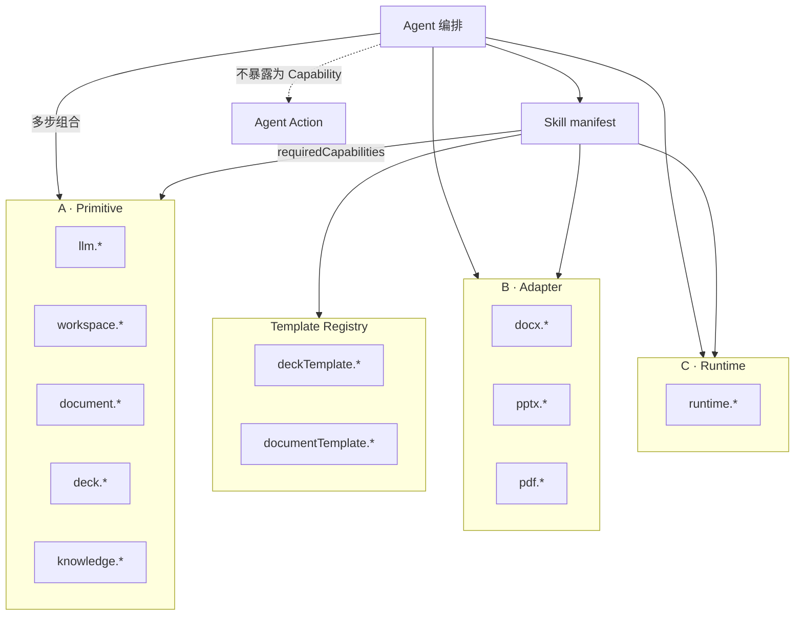

# AI Office Core Capability API（第一版 · 修订）

> 版本：v0.3（设计稿）  
> 适用范围：`ai_writer3.0-public`  
> 关联文档：[AI_OFFICE_SKILL_BOUNDARY_DESIGN.md](./AI_OFFICE_SKILL_BOUNDARY_DESIGN.md)

---

## 1. 设计原则

### 1.1 Core Capability 是什么

**Core Capability** 是 AI Office **本体提供的稳定执行 API**（非 Skill 包内代码）。第一版修订将能力按粒度分为四类，避免把底层原子能力、格式适配、运行时横切与 Agent 复合动作混在同一清单。

### 1.2 四类能力分层

| 类型 | 前缀 / 命名空间 | 定义 | Skill 是否直接声明 |
|------|-----------------|------|-------------------|
| **A. Primitive Capability** | `llm.*`、`knowledge.*`、`workspace.*`、`document.*`、`deck.*` | 真正底层、稳定、可复用的**领域原子**操作 | 是 |
| **B. Adapter Capability** | `docx.*`、`pptx.*`、`pdf.*` | 对 DOCX/PPTX/PDF 或遗留复杂模块的**格式适配** | 是（按格式） |
| **C. Runtime Capability** | `runtime.*` | 进度、日志、权限校验钩子、成本统计等**横切运行时** | 是（Workflow 常用） |
| **D. Agent Action** | 无统一 `host.call` id；文档化命名 | Agent **编排多个 Capability** 完成的复合动作 | **否**（不写入 `requiredCapabilities`） |



### 1.3 Agent 只负责任务编排

- 选择 Skill、执行 `workflow.steps` 或对话策略  
- 将 **Agent Action** 展开为若干 `host.call(primitive|adapter|runtime, …)`  
- 不内嵌 DOCX/PPTX 解析、不直连 LLM HTTP  

### 1.4 Skill 只声明依赖

Skill 的 `manifest.json` 仅列出 **A / B / C / Registry** 能力 id；**不得**把 Agent Action 登记为 `requiredCapabilities`。

### 1.5 统一执行与计费

所有副作用经 Capability 网关，返回统一信封（§2），便于权限、`cost` 与审计。

---

## 2. 统一返回格式

```json
{
  "ok": true,
  "data": {},
  "error": {
    "code": "string",
    "message": "string",
    "detail": {}
  },
  "cost": {
    "llmCalls": 0,
    "imageCalls": 0,
    "tokenEstimate": 0
  }
}
```

### 2.1 通用错误码

| code | 含义 |
|------|------|
| `CAPABILITY_NOT_FOUND` | 未知 capability id |
| `PERMISSION_DENIED` | Skill / 用户无权限 |
| `INVALID_INPUT` | 参数校验失败 |
| `WORKSPACE_NOT_FOUND` | 工作区路径无效 |
| `RESOURCE_NOT_FOUND` | 文档 / deck / 文件不存在 |
| `ENGINE_ERROR` | 底层引擎异常 |
| `LLM_UNAVAILABLE` | 模型未配置或调用失败 |
| `TIMEOUT` / `CANCELLED` | 超时 / 用户取消 |

### 2.2 字段约定（各 Capability 表格共用）

| 列 | 含义 |
|----|------|
| **Token** | 是否计入 `cost.tokenEstimate` |
| **Skill** | 普通 Template / Workflow Skill 是否允许 `host.call` |
| **Status** | `implementationStatus`（见 §3） |
| **失败** | `error.code` 典型值 |
| **现有代码** | 当前仓库中的实现落点（迁移参考，非运行时协议） |

---

## 3. 成熟度分级（implementationStatus）

Capability 在 Catalog 中除契约 id 外，必须标注 **`implementationStatus`**，供 Skill 安装器、manifest 校验器与 Agent 运行时决策是否允许调用。

### 3.1 枚举定义

| 状态 | 含义 | Skill `requiredCapabilities` | `invokeCapability`（目标） |
|------|------|------------------------------|------------------------------|
| **stable** | 契约、参数校验、统一 `CapabilityResult` 信封均已在本体实现；不依赖遗留 IPC 形状 | 允许声明 | 允许调用 |
| **wrapper** | 已有可靠业务实现，经 Catalog **转发**到现有 IPC/服务；返回信封由网关适配 | 允许声明 | 允许调用（经 wrapper） |
| **planned** | 契约已定义，**尚无**可调用实现；manifest 可声明但运行时应拒绝或仅做静态校验 | 允许声明（安装期警告） | **拒绝**调用 |
| **restricted** | 仅 Agent / 平台内置模块可调用；普通 Skill **不得**写入 `requiredCapabilities` | **禁止** Skill 声明 | Skill 拒绝；Agent 允许 |
| **deprecated** | 已更名或合并；保留 alias 与迁移提示 | 不建议声明 | 转发到新 id 并打日志 |

**与分层的区别**：`layer`（primitive / adapter / runtime / registry）描述**语义粒度**；`implementationStatus` 描述**工程就绪度**。二者正交。

### 3.2 全量 Capability 成熟度登记表（推荐状态）

下表为 v0.3 **推荐标注**（实现前以 Catalog 源数据为准）。「第一批」表示计划经 Catalog + Validator 落地统一 invoke 路径（仍为 wrapper 转发亦可）。

| Capability | Layer | implementationStatus | Skill 可声明 | 备注 |
|------------|-------|----------------------|--------------|------|
| `llm.generate` | primitive | **wrapper** | ✓ | `llmClient.completeText` |
| `llm.generateJson` | primitive | **planned** | ✓ | 待独立入口与 schema 校验 |
| `knowledge.retrieve` | primitive | **wrapper** | ✓ | `knowledge:retrieveChunks` |
| `workspace.readFile` | primitive | **wrapper** | ✓ | |
| `workspace.writeFile` | primitive | **wrapper** | ✓ | |
| `workspace.copyFile` | primitive | **wrapper** | ✓ | |
| `runtime.reportProgress` | runtime | **wrapper** | ✓ | |
| `runtime.writeLog` | runtime | **restricted** | **✗** | Skill 不得声明；Agent / Runtime 自动写日志 |
| `document.create` | primitive | **wrapper** | ✓ | |
| `document.load` | primitive | **wrapper** | ✓ | |
| `document.save` | primitive | **wrapper** | ✓ | |
| `document.applyPatch` | primitive | **planned** | ✓ | **暂缓** invoke（见 §3.4） |
| `document.renderPreview` | primitive | **planned** | ✓ | |
| `docx.readPackage` | adapter | **wrapper** | ✓ | |
| `docx.importTemplate` | adapter | **planned** | ✓ | |
| `docx.extractFields` | adapter | **planned** | ✓ | |
| `docx.writeback` | adapter | **planned** | ✓ | **暂缓** invoke（见 §3.4） |
| `docx.export` | adapter | **wrapper** | ✓ | |
| `pdf.export` | adapter | **wrapper** | ✓ | |
| `deck.create` | primitive | **wrapper** | ✓ | 非第一批 invoke |
| `deck.load` | primitive | **wrapper** | ✓ | **第一批** |
| `deck.save` | primitive | **wrapper** | ✓ | **第一批** |
| `deck.applyPatch` | primitive | **planned** | ✓ | 沿用 `deck:updateSlide` 直至 patch 契约落地 |
| `deck.render` | primitive | **wrapper** | ✓ | **第一批** |
| `deck.preview` | primitive | **wrapper** | ✓ | **第一批** |
| `pptx.extract` | adapter | **wrapper** | ✓ | |
| `pptx.import` | adapter | **restricted** | **✗** | 仅 Agent；**暂缓**对 Skill 开放 |
| `deckTemplate.list` | registry | **wrapper** | ✓ | **第一批** |
| `deckTemplate.validate` | registry | **planned** | ✓ | |
| `documentTemplate.list` | registry | **planned** | ✓ | |
| `documentTemplate.validate` | registry | **planned** | ✓ | **暂缓**（见 §3.4） |

### 3.3 第一批真实实现范围

**本轮工程目标**（文档 + 后续代码批次；**不**在本轮实现 `invokeCapability` 业务逻辑本身时，以 Catalog/Validator 为交付物）：

| 交付物 | 说明 |
|--------|------|
| **Capability Catalog** | 全量条目源数据（含 `implementationStatus`、IPC 映射、Skill 策略） |
| **Capability Validator** | 校验 Skill `manifest.requiredCapabilities` 与调用方类型（skill / agent） |
| **统一 invoke 路由（仅下列 id）** | 经 Catalog 注册表转发至现有服务，返回目标 `CapabilityResult` 信封 |

**第一批允许走 Catalog invoke 路由的 capability id：**

1. `deck.load`  
2. `deck.save`  
3. `deck.render`  
4. `deck.preview`  
5. `deckTemplate.list`  

另：**Catalog 与 Validator 本身**需随第一批一并落地（所有 id 可查询；仅上表 5 项 + 基础设施可 invoke）。

**不在第一批 invoke 内、维持现状（直接 IPC / 旧路径）的能力**：其余所有 wrapper/planned 条目，直至后续批次提升。

### 3.4 明确暂缓项

以下能力**契约保留、Catalog 可登记**，但第一批 **不** 实现 invoke 路由，且 Validator 对 Skill 运行时应按状态拦截或告警：

| Capability | 暂缓原因 | Validator / Skill 策略 |
|------------|----------|------------------------|
| `document.applyPatch` | 块级 patch 契约与 `DocumentPatch` 网关未收敛 | `planned` → Skill run **拒绝** invoke |
| `docx.writeback` | 依赖 formal 流程与 OOXML 回写边界 | `planned` → Skill run **拒绝** invoke |
| `pptx.import` | 复合导入，仅 Agent Action 编排 | `restricted` → Skill **不得**声明于 manifest |
| `documentTemplate.validate` | 需合并 schema + `docx.extractFields` | `planned` → Skill run **拒绝** invoke |

**相关但仍为 planned、非第一批、未单独列入暂缓表**：`llm.generateJson`、`document.renderPreview`、`docx.importTemplate`、`docx.extractFields`、`deck.applyPatch`、`deckTemplate.validate`、`documentTemplate.list` 等 — 仅静态 manifest 校验，不开放 invoke。

### 3.5 Capability Catalog 字段设计（代码层）

后续代码建议位置（**本轮不创建文件**）：

- `src/capabilities/capabilityCatalog.ts` — 只读注册表  
- `src/capabilities/capabilityValidator.ts` — manifest / 调用方校验  
- `src/capabilities/capabilityTypes.ts` — 类型与枚举  
- `electron/main/capabilities/capabilityRouter.ts` — 主进程 invoke 转发（第一批 deck*）

#### 3.5.1 枚举

```typescript
type CapabilityLayer = 'primitive' | 'adapter' | 'runtime' | 'registry'

type ImplementationStatus =
  | 'stable'
  | 'wrapper'
  | 'planned'
  | 'restricted'
  | 'deprecated'

type SkillCallablePolicy = 'allowed' | 'workflow-only' | 'forbidden'

type InvokeBatch = 'none' | 'batch-1-deck' | 'batch-2-document' | 'future'
```

#### 3.5.2 `CapabilityCatalogEntry`（单条）

| 字段 | 类型 | 必填 | 说明 |
|------|------|------|------|
| `id` | `string` | ✓ | 如 `deck.load` |
| `version` | `string` | ✓ | 契约版本，如 `1` |
| `layer` | `CapabilityLayer` | ✓ | 语义分层 |
| `implementationStatus` | `ImplementationStatus` | ✓ | 成熟度 |
| `displayName` | `string` | ✓ | 可读名称 |
| `description` | `string` | | 一句话说明 |
| `consumesTokens` | `boolean` | ✓ | 是否可能产生 `cost.tokenEstimate` |
| `skillCallable` | `SkillCallablePolicy` | ✓ | Skill 是否可声明/调用；`restricted` 能力为 `forbidden` |
| `invokeBatch` | `InvokeBatch` | ✓ | `batch-1-deck` 等，供路由器筛选 |
| `invokeEnabled` | `boolean` | ✓ | 当前版本是否注册 invoke 处理器（第一批仅 deck* + list 为 true） |
| `wrapper` | `CapabilityWrapperRef` | △ | `implementationStatus === 'wrapper' \| 'stable'` 时必填 |
| `replaces` | `string[]` | | deprecated 时指向新 id |
| `notes` | `string` | | 迁移/暂缓说明 |

#### 3.5.3 `CapabilityWrapperRef`（转发描述）

| 字段 | 类型 | 说明 |
|------|------|------|
| `transport` | `'ipc' \| 'in-process'` | 转发方式 |
| `target` | `string` | 如 `deck:load` 或 `deckDocumentService.loadDeckDocument` |
| `requestMap` | `string` | 可选：params → 遗留 payload 的映射策略 id |
| `responseMap` | `string` | 可选：遗留结果 → `CapabilityResult` 的适配器 id |

#### 3.5.4 `CapabilityCatalog`（集合）

```typescript
interface CapabilityCatalog {
  schemaVersion: 'ai-office-capability-catalog-v1'
  generatedAt: string
  entries: CapabilityCatalogEntry[]
}

function getCatalogEntry(id: string): CapabilityCatalogEntry | undefined
function listEntries(filter?: {
  layer?: CapabilityLayer
  implementationStatus?: ImplementationStatus
  invokeEnabled?: boolean
}): CapabilityCatalogEntry[]
```

#### 3.5.5 Validator 输入/输出

```typescript
interface ValidateManifestCapabilitiesInput {
  requiredCapabilities: string[]
  skillKind: 'template' | 'workflow' | 'style' | 'adapter'
  callerType: 'skill' | 'agent' | 'ui'
}

interface ValidateManifestCapabilitiesResult {
  ok: boolean
  errors: Array<{
    capability: string
    code: 'UNKNOWN_CAPABILITY' | 'RESTRICTED_FOR_SKILL' | 'PLANNED_NOT_INVOKABLE' | 'DEPRECATED'
    message: string
  }>
  warnings: Array<{
    capability: string
    code: 'PLANNED_DECLARED' | 'WRAPPER_ONLY'
    message: string
  }>
}
```

**校验规则摘要：**

1. 每个 `requiredCapabilities` id 必须存在于 Catalog。  
2. `skillCallable === 'forbidden'`（含 `pptx.import`、`runtime.writeLog`）→ 任意 Skill manifest **error**。  
3. `implementationStatus === 'planned'` 且 Skill 尝试 invoke → **error**（静态 manifest 仅 **warning**）。  
4. `implementationStatus === 'restricted'` 且 `callerType === 'skill'` 且 manifest 已声明 → **error**。  
5. `invokeEnabled === false` 时 invoke 路由返回 `CAPABILITY_NOT_FOUND` 或 `PLANNED_NOT_INVOKABLE`。  
6. `deprecated` → **warning**，并建议 `replaces` 中的新 id。

#### 3.5.6 Catalog 条目示例（第一批）

```json
{
  "id": "deck.load",
  "version": "1",
  "layer": "primitive",
  "implementationStatus": "wrapper",
  "displayName": "加载 Deck 文档",
  "description": "从工作区 05_Presentation/decks/<id>/deck.json 加载",
  "consumesTokens": false,
  "skillCallable": "allowed",
  "invokeBatch": "batch-1-deck",
  "invokeEnabled": true,
  "wrapper": {
    "transport": "in-process",
    "target": "deckDocumentService.loadDeckDocument",
    "responseMap": "capabilityResult.v1"
  }
}
```

```json
{
  "id": "pptx.import",
  "version": "1",
  "layer": "adapter",
  "implementationStatus": "restricted",
  "displayName": "PPTX 一站式导入",
  "consumesTokens": false,
  "skillCallable": "forbidden",
  "invokeBatch": "none",
  "invokeEnabled": false,
  "notes": "仅 Agent Action；Skill 不得声明"
}
```

---

## 4. 第一版能力总表

> 各 Capability 的 **`implementationStatus`** 与第一批 invoke 范围见 **§3.2–§3.4**。

### 4.1 A · 通用 Primitive

| Capability | 简述 | Token | Skill |
|------------|------|-------|-------|
| `llm.generate` | 自然语言生成 | 是 | ✓ |
| `llm.generateJson` | 结构化 JSON 生成 | 是 | ✓ |
| `knowledge.retrieve` | 知识库分块检索 | 否 | ✓ |
| `workspace.readFile` | 读工作区相对路径 | 否 | ✓ |
| `workspace.writeFile` | 写工作区相对路径 | 否 | ✓ |
| `workspace.copyFile` | 复制工作区内文件 | 否 | ✓ |

### 4.2 C · Runtime

| Capability | 简述 | Token | Skill |
|------------|------|-------|-------|
| `runtime.reportProgress` | 任务步骤进度 | 否 | ✓ |
| `runtime.writeLog` | 审计 / 行为日志 | 否 | ✗ |

### 4.3 A · Document Primitive

| Capability | 简述 | Token | Skill |
|------------|------|-------|-------|
| `document.create` | 创建 `DocumentSchema` | 否 | ✓ |
| `document.load` | 加载 `document.json` | 否 | ✓ |
| `document.save` | 持久化文档模型 | 否 | ✓ |
| `document.applyPatch` | 块级补丁（原 `updateBlock`） | 否 | ✓ |
| `document.renderPreview` | 文档 HTML/快照预览 | 否 | ✓ |

### 4.4 B · DOCX Adapter

| Capability | 简述 | Token | Skill |
|------------|------|-------|-------|
| `docx.readPackage` | 读取 OOXML 包快照 | 否 | ✓ |
| `docx.importTemplate` | 自 DOCX 导入模板结构 | 否 | ✓ |
| `docx.extractFields` | 提取可填字段 | 否 | ✓ |
| `docx.writeback` | 按规则回写 OOXML | 否 | ✓ |
| `docx.export` | 导出 DOCX 文件 | 否 | ✓ |

### 4.5 B · PDF Adapter

| Capability | 简述 | Token | Skill |
|------------|------|-------|-------|
| `pdf.export` | 自文档/HTML/Markdown 导出 PDF | 否 | ✓ |

### 4.6 A · Deck Primitive

| Capability | 简述 | Token | Skill |
|------------|------|-------|-------|
| `deck.create` | 创建 `DeckDocument` | 否 | ✓ |
| `deck.load` | 加载 `deck.json` | 否 | ✓ |
| `deck.save` | 持久化 deck | 否 | ✓ |
| `deck.applyPatch` | 幻灯片/槽位补丁（原 `updateSlide`） | 否 | ✓ |
| `deck.render` | 渲染为 PPTX | 否 | ✓ |
| `deck.preview` | 幻灯片缩略图预览 | 否 | ✓ |

### 4.7 B · PPTX Adapter

| Capability | 简述 | Token | Skill |
|------------|------|-------|-------|
| `pptx.extract` | 从 PPTX 提取结构与文本 | 否 | ✓ |
| `pptx.import` | 一站式导入为 deck（restricted convenience adapter） | 否 | ✗ / Agent only |

> **说明（`pptx.import`）**：内部等价于 `pptx.extract` → `deck.create` → `deck.applyPatch` → `deck.save`。它是 **Agent Action / 内置 Workflow** 的便捷 adapter（`implementationStatus: restricted`），**不允许**普通 Skill 在 `requiredCapabilities` 中声明。普通 Skill 如需处理 PPTX，应声明 **`pptx.extract`**，由 Agent 或 Workflow 编排后续 `deck.create` / `deck.applyPatch` / `deck.save`（或走平台内置导入流程），而不是声明 `pptx.import`。

### 4.8 Template Registry（元数据，非格式适配）

| Capability | 简述 | Token | Skill |
|------------|------|-------|-------|
| `deckTemplate.list` | 列出 PPT 模板 manifest | 否 | ✓ |
| `deckTemplate.validate` | 校验 deck 模板与 slot-rules | 否 | ✓ |
| `documentTemplate.list` | 列出文稿模板 manifest | 否 | ✓ |
| `documentTemplate.validate` | 校验字段 schema / writeback 规则 | 否 | ✓ |

---

## 5. v0.1 → v0.2 更名与降级

| v0.1（已废弃） | v0.2 处理 |
|----------------|-----------|
| `workspace.saveFile` | **Agent Action**；用 `workspace.writeFile` / `workspace.copyFile` + `document.save` / `deck.save` 组合 |
| `workspace.copyAsset` | 更名为 `workspace.copyFile` |
| `task.reportProgress` | 更名为 `runtime.reportProgress` |
| `task.writeLog` | 更名为 `runtime.writeLog` |
| `document.updateBlock` | 更名为 `document.applyPatch` |
| `document.preview` | 更名为 `document.renderPreview` |
| `document.importDocxTemplate` | 迁至 `docx.importTemplate` |
| `document.extractTemplateFields` | 迁至 `docx.extractFields`；校验阶段可用 `documentTemplate.validate` |
| `document.writebackToTemplate` | 迁至 `docx.writeback` |
| `document.exportDocx` | 迁至 `docx.export` |
| `document.exportPdf` | 迁至 `pdf.export` |
| `deck.updateSlide` | 更名为 `deck.applyPatch` |
| `deck.importPptx` | 拆为 `pptx.extract` + `deck.create`/`deck.save`，或 `pptx.import` |
| `deck.exportPptx` | **非**最小 Capability；**Agent Action**：`deck.render` + `workspace.copyFile` |
| `template.list` | 拆为 `deckTemplate.list` + `documentTemplate.list` |
| `template.validate` | 拆为 `deckTemplate.validate` + `documentTemplate.validate` |

### 5.1 Agent Action 示例（不进入 manifest）

| Agent Action | 典型 Capability 组合 |
|--------------|---------------------|
| `saveManuscript` | `document.save` 或 `workspace.writeFile` |
| `exportDeckToUserPath` | `deck.render` → `workspace.copyFile` |
| `importPptxAsNewDeck` | `pptx.extract` → `deck.create` → `deck.applyPatch` → `deck.save` |
| `buildDeckFromManuscript` | `document.load` → `llm.generateJson` → `deck.create` → `deck.applyPatch` → `deck.render` |
| `registerWorkspace` | 平台工作区服务（**非** Skill Capability） |

---

## 6. Capability 规格（按类）

### 6.1 A · 通用 Primitive

#### `llm.generate`

| 项 | 内容 |
|----|------|
| 输入 | `{ systemPrompt, userPrompt, temperature?, maxTokens?, images?, featureName? }` |
| 输出 | `{ text, provider, model }` |
| Token / Skill / 失败 | 是 / ✓ / `LLM_UNAVAILABLE` |
| 现有代码 | `electron/main/services/llmClient.ts` → `completeText()` |

#### `llm.generateJson`

| 项 | 内容 |
|----|------|
| 输入 | `{ systemPrompt, userPrompt, schema?, temperature?, maxTokens?, featureName? }` |
| 输出 | `{ json, rawText? }` |
| Token / Skill / 失败 | 是 / ✓ / `LLM_UNAVAILABLE`, `INVALID_JSON` |
| 现有代码 | 各服务在 `completeText` 后 `JSON.parse`（待收敛为独立入口） |

#### `knowledge.retrieve`

| 项 | 内容 |
|----|------|
| 输入 | `{ departmentId, query, constraints?, limit? }` |
| 输出 | `{ chunks[], mode }` |
| Token / Skill / 失败 | 否 / ✓ / `RESOURCE_NOT_FOUND` |
| 现有代码 | `knowledgeService.ts`；IPC `knowledge:retrieveChunks` |

#### `workspace.readFile` / `workspace.writeFile` / `workspace.copyFile`

| 项 | 内容 |
|----|------|
| 输入 | `{ workspacePath, relativePath, … }`（copy 含 `targetRelativePath`） |
| 输出 | `{ content \| size \| targetRelativePath }` |
| Token / Skill / 失败 | 否 / ✓ / `WORKSPACE_NOT_FOUND`, `RESOURCE_NOT_FOUND` |
| 现有代码 | `workspaceService.ts`；IPC `workspace:writeFile`, `workspace:copyPath` |

---

### 6.2 C · Runtime

#### `runtime.reportProgress`

| 项 | 内容 |
|----|------|
| 输入 | `{ taskId, stepId, percent, message?, status? }` |
| 输出 | `{ acknowledged: true }` |
| 现有代码 | `localTaskService.ts`；`workspace:appendTaskHistory` |

#### `runtime.writeLog`

| 项 | 内容 |
|----|------|
| 输入 | `{ module, action, eventType, details?, status? }` |
| 输出 | `{ logId? }` |
| Skill | **禁止**声明（`skillCallable: forbidden`） |
| 现有代码 | `userActionLogService.ts` |

---

### 6.3 A · Document Primitive

#### `document.create` / `document.load` / `document.save`

| 项 | 内容 |
|----|------|
| 数据模型 | `DocumentSchema`（`src/document/schema`） |
| 现有代码 | `workspaceService.readWorkspaceDocumentSchema` / `saveWorkspaceDocumentSchema` |

#### `document.applyPatch`

| 项 | 内容 |
|----|------|
| 输入 | `{ workspacePath, patches: DocumentPatch[] }` |
| 输出 | `{ document, appliedCount }` |
| 说明 | 统一块级、选区、槽位更新；替代 v0.1 `document.updateBlock` |
| 现有代码 | `src/document/core`；`documentEngine.applyTextEdit`；`templateDocumentOrchestrator` |

#### `document.renderPreview`

| 项 | 内容 |
|----|------|
| 输入 | `{ workspacePath, document?, format?: "html" \| "snapshot" }` |
| 输出 | `{ previewHtml?, previewPath? }` |
| 现有代码 | `src/document/preview/`；`formalTemplate:preview` |

---

### 6.4 B · DOCX Adapter

#### `docx.readPackage`

| 项 | 内容 |
|----|------|
| 输入 | `{ filePath }` |
| 输出 | `{ ooxmlSnapshot }` |
| 现有代码 | IPC `documentEngine:readOoxmlPackage` |

#### `docx.importTemplate`

| 项 | 内容 |
|----|------|
| 输入 | `{ workspacePath, templatePath, mode? }` |
| 输出 | `{ document, ooxmlSnapshot? }` |
| 现有代码 | `documentSchemaDocxBoundary.importDocumentSchemaFromOoxmlSnapshot` |

#### `docx.extractFields`

| 项 | 内容 |
|----|------|
| 输入 | `{ templatePath \| documentId, workspacePath }` |
| 输出 | `{ fields[] }` |
| 现有代码 | IPC `formalTemplate:analyze` |

#### `docx.writeback` / `docx.export`

| 项 | 内容 |
|----|------|
| writeback 输入 | `{ document, templatePath, writebackRules, outputPath? }` |
| export 输入 | `{ document \| markdown \| html, targetPath?, journalFormatId? }` |
| 现有代码 | `formalTemplate:commit`；`journalDocxExporter.ts`；`pdfExporter.exportDocxToPath` |

---

### 6.5 B · PDF Adapter

#### `pdf.export`

| 项 | 内容 |
|----|------|
| 输入 | `{ markdown?, editorHtml?, title, targetPath? }` |
| 输出 | `{ filePath }` |
| 现有代码 | `pdfExporter.ts`；IPC `ai:exportPdf`, `ai:exportPdfFromEditor` |

---

### 6.6 A · Deck Primitive

#### `deck.create` / `deck.load` / `deck.save`

| 项 | 内容 |
|----|------|
| 存储 | `<workspace>/05_Presentation/decks/<deckId>/deck.json` |
| 现有代码 | `deckDocumentService.ts`；IPC `deck:load`, `deck:save` |

#### `deck.applyPatch`

| 项 | 内容 |
|----|------|
| 输入 | `{ workspacePath, deckId, slideIndex?, slots?, patches? }` |
| 说明 | 单页槽位更新或多页批量补丁；替代 `deck.updateSlide` |
| 现有代码 | IPC `deck:updateSlide`, `deck:updateDeckDocument` |

#### `deck.render` / `deck.preview`

| 项 | 内容 |
|----|------|
| render 输出 | `{ pptxPath, outputPath, slideCount, manifestId, templateId, cloneRendererUsed? }` |
| preview 输出 | `{ slides: [{ index, imagePath }] }` |
| 现有代码 | `retemplateEngine.ts`；`pptxPreviewService.ts`；IPC `deck:render`, `deck:preview` |

---

### 6.7 B · PPTX Adapter

#### `pptx.extract` / `pptx.import`

| 项 | 内容 |
|----|------|
| extract 输出 | `{ slides[], layouts?, contentPackage? }` |
| import 输出 | `{ deck, deckId }` |
| 现有代码 | `pptxImportService.ts`；IPC `deck:extractPptx`, `deck:buildFromImportedPptx` |

---

### 6.8 Template Registry

#### `deckTemplate.list` / `deckTemplate.validate`

| 项 | 内容 |
|----|------|
| 现有代码 | `pptTemplateRegistry.ts`；`src/types/pptTemplateManifest.ts`；`validateDeckDocument` |

#### `documentTemplate.list` / `documentTemplate.validate`

| 项 | 内容 |
|----|------|
| 说明 | `validate` 可合并 schema 校验 + `docx.extractFields` 结果对照 |
| 现有代码 | `src/types/templateGeneration.ts`；formal 模板流程 |

---

## 7. 调用矩阵（速查）

> **权威来源**：某 capability 是否允许 Skill **声明**（`requiredCapabilities`）或 **调用**（invoke），以 **Capability Catalog** 条目为准，看 `skillCallable`、`implementationStatus`、`invokeEnabled` — **不是**仅看 namespace 前缀。

| 分层 | 前缀 | Skill 默认 | Agent | Catalog 例外 / 备注 |
|------|------|------------|-------|-------------------|
| Primitive | `llm`, `knowledge`, `workspace`, `document`, `deck` | 取决于 Catalog | ✓ | 如 `document.applyPatch` 为 `planned` 时 Skill 不可 invoke |
| Adapter | `docx`, `pptx`, `pdf` | 取决于 Catalog | ✓ | **`pptx.import` 禁止 Skill 声明**（`restricted`）；普通 Skill 用 `pptx.extract` |
| Runtime | `runtime` | 取决于 Catalog | ✓ | **`runtime.writeLog` 禁止 Skill 声明**（Agent / Runtime 自动记录） |
| Registry | `deckTemplate`, `documentTemplate` | 取决于 Catalog | ✓ | 如 `documentTemplate.validate` 为 `planned` 时暂缓 invoke |
| Agent Action | — | ✗（不得写入 manifest） | 编排实现 | 非 Catalog capability id |

**校验顺序（Skill 安装 / 运行）**：

1. Catalog 是否存在该 `id`  
2. `skillCallable` 是否允许当前 `skillKind` / `callerType`  
3. `implementationStatus` 是否为 `restricted` / `planned` / `deprecated`  
4. `invokeEnabled` 是否允许本次 invoke（第一批仅部分 deck* 为 `true`）

---

## 8. 宿主调用约定（目标）

```typescript
type CapabilityLayer = 'primitive' | 'adapter' | 'runtime' | 'registry'

type CapabilityId =
  | `llm.${string}`
  | `knowledge.${string}`
  | `workspace.${string}`
  | `runtime.${string}`
  | `document.${string}`
  | `deck.${string}`
  | `docx.${string}`
  | `pptx.${string}`
  | `pdf.${string}`
  | `deckTemplate.${string}`
  | `documentTemplate.${string}`

interface CapabilityInvokeRequest {
  capability: CapabilityId
  workspaceId?: string
  params: Record<string, unknown>
  caller: { type: 'agent' | 'skill' | 'ui'; id: string; skillManifestId?: string }
}

interface CapabilityResult<T = unknown> {
  ok: boolean
  data: T
  error?: { code: string; message: string; detail?: Record<string, unknown> }
  cost?: { llmCalls: number; imageCalls: number; tokenEstimate: number }
}
```

**迁移**：IPC 层逐步映射到上表 id，并统一 `CapabilityResult` 信封；invoke 落地范围见 **§3.3**（第一批仅 deck 相关 + Catalog/Validator）。

---

## 9. IPC 对照（实现参考）

| v0.2 Capability | 现有 IPC / 服务 |
|-----------------|-----------------|
| `workspace.readFile` | `workspace:tree`（读目录后按需读文件） |
| `workspace.writeFile` | `workspace:writeFile` |
| `workspace.copyFile` | `workspace:copyPath` |
| `document.load` / `document.save` | `workspace:readDocumentSchema`, `workspace:saveDocumentSchema` |
| `document.applyPatch` | `documentEngine` 编辑通道 |
| `docx.readPackage` | `documentEngine:readOoxmlPackage` |
| `docx.importTemplate` | OOXML 导入边界 + formal 流程 |
| `docx.extractFields` | `formalTemplate:analyze` |
| `docx.writeback` | `formalTemplate:commit` |
| `docx.export` | `exportDocxToPath`, `exportWithJournalFormat` |
| `pdf.export` | `ai:exportPdf`, `ai:exportPdfFromEditor` |
| `knowledge.retrieve` | `knowledge:retrieveChunks` |
| `deck.*` | `deck:load`, `deck:save`, `deck:render`, `deck:preview`, `deck:updateSlide` |
| `pptx.extract` | `deck:extractPptx` |
| `pptx.import` | `deck:buildFromImportedPptx`, `pptx:importFromFile` |
| `deckTemplate.list` | `pptx:listSkills` |
| `runtime.reportProgress` | `localTaskService` / AI 事件 |

---

## 10. 范围外（后续版本）

- `image.generate` — `imageClient.ts`  
- `mail.parse` / `mail.send` — 邮件 Agent  
- `workspace.create` / `workspace.register` — 仅 Agent / UI  
- `llm.stream` — `streamText()`  

---

## 11. 当前代码落地状态

> 截至仓库实现批次：`feat: add core capability catalog and deck router`

### 11.1 已实现

| 模块 | 路径 | 说明 |
|------|------|------|
| **类型与契约** | `src/capabilities/capabilityTypes.ts` | `CapabilityId` 全量枚举、`CapabilityResult` 信封等 |
| **Catalog** | `src/capabilities/capabilityCatalog.ts` | `CAPABILITY_CATALOG` 31 项，含 `implementationStatus` / `invokeEnabled` |
| **Validator** | `src/capabilities/capabilityValidator.ts` | `validateManifestCapabilities`、`validateCapabilityInvoke` |
| **统一导出** | `src/capabilities/index.ts` | 渲染进程 / 工具脚本可引用 |
| **Invoke 路由（第一批）** | `electron/main/capabilities/capabilityRouter.ts` | `invokeCapability()` |
| **冒烟测试** | `scripts/smoke-capability-layer.ts` | Catalog / Validator 静态校验 |

### 11.2 第一批可 invoke 的 capability

经 `invokeCapability()` 转发至现有服务（返回统一 `CapabilityResult`，deck 类 `cost` 恒为 0）：

| capability | 转发目标 |
|------------|----------|
| `deck.load` | `deckDocumentService.loadDeckDocument` |
| `deck.save` | `deckDocumentService.saveDeckDocument` |
| `deck.render` | `deckDocumentService.renderDeckDocument`（`data` 含 `pptxPath` 与 `outputPath`） |
| `deck.preview` | `pptxPreviewService.renderPptxPreview` |
| `deckTemplate.list` | `pptTemplateRegistry.listPptTemplates` |

### 11.3 尚未接入 invoke

- 其余 capability 仅在 Catalog 中登记契约与成熟度，**不**经 `invokeCapability` 执行。  
- `planned`（如 `document.applyPatch`、`docx.writeback`、`llm.generateJson`）invoke 返回 `PLANNED_NOT_INVOKABLE`。  
- `restricted` 的 `pptx.import`、`runtime.writeLog`：`skillCallable: forbidden`，任意 Skill manifest 校验拒绝声明；日志由 Agent / Runtime 自动写入。  
- **未修改**现有 IPC（`deck:load` 等）与 UI 调用路径；Capability 层为并行新增基础设施。

### 11.4 本地验证

```bash
npm run typecheck
npx tsx scripts/smoke-capability-layer.ts
```

---

## 12. 下一层：Skill Manifest Validator

| 层级 | 模块 | 说明 |
|------|------|------|
| Core Capability | `src/capabilities/*` | 定义能力契约、Catalog、invoke 路由（第一批 deck） |
| **Skill Manifest** | `src/skills/manifest/*` | 校验 Skill 包 `manifest.json` 是否合法、安全、可安装 |

要点：

- **manifest.json** 是 AI Office 运行时读取的**机器协议**（字段见 [AI_OFFICE_SKILL_MANIFEST_VALIDATOR.md](./AI_OFFICE_SKILL_MANIFEST_VALIDATOR.md)）。
- **skill.md** 仅为说明 / prompt 文档，**不作为**唯一运行协议。
- Manifest 校验会调用 `validateManifestCapabilities`，并额外检查 assets 路径、permissions 白名单、workflow.steps。
- 本层**不**执行 shell、不安装依赖、不调用 `invokeCapability`（除非后续安装器显式集成）。

```bash
npx tsx scripts/smoke-skill-manifest-validator.ts
```

---

*文档维护：架构组 · 设计稿 v0.3 · 2026-05*
