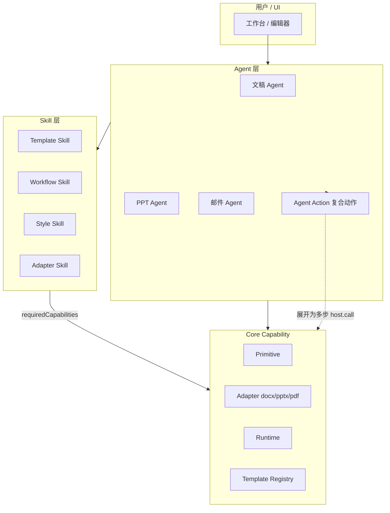

# AI Office Skill 边界设计

> 版本：v0.2（设计稿）  
> 适用范围：`ai_writer3.0-public`  
> 关联：[AI_OFFICE_CORE_CAPABILITY_API.md](./AI_OFFICE_CORE_CAPABILITY_API.md)

---

## 1. 架构总览



**职责分工**

| 层级 | 职责 | 不负责 |
|------|------|--------|
| **Agent** | 意图理解、选 Skill、编排步骤；**Agent Action** 展开为多个 Capability | 不内嵌 OOXML/PPTX/LLM |
| **Skill** | 声明模板、流程、风格、规则与 **Primitive / Adapter / Runtime / Registry** 依赖 | 不替代编辑器、渲染器、文件系统 |
| **Core Capability** | 原子 / 适配 / 运行时 / 模板元数据 API | 不含业务写作策略 |
| **Agent Action** | 文档化复合流程（如导出 deck 到用户路径） | **不**写入 Skill `requiredCapabilities` |

---

## 2. Core Capability 四层（与 Skill 的关系）

Skill 的 `requiredCapabilities` **只能**引用以下四类 id（详见 Core API 文档）：

| 类 | 示例 | Skill 典型用途 |
|----|------|----------------|
| **A. Primitive** | `document.applyPatch`, `deck.render`, `llm.generate` | 改文稿、渲染 PPT、调模型 |
| **B. Adapter** | `docx.writeback`, `pptx.extract`, `pdf.export` | 格式导入导出 |
| **C. Runtime** | `runtime.reportProgress` | Workflow 上报进度 |
| **Registry** | `deckTemplate.validate`, `documentTemplate.validate` | 安装/启用前校验模板包 |
| **D. Agent Action** | `exportDeckToUserPath`, `saveManuscript` | **仅 Agent 实现**，Skill 不声明 |

---

## 3. 什么是 AI Office Skill

### 3.1 定义

**AI Office Skill** 是可安装、可版本化、可审计的能力包，声明：

- 任务类型与 `kind`（template \| workflow \| style \| adapter）
- `requiredCapabilities`（仅 A/B/C/Registry）
- `inputs` / `outputs`、`assets`、`permissions`、`workflow`

Skill = **声明 + 规则 + 资产**，不是 LLM 的唯一载体，也不是 DOCX/PPTX 引擎。

### 3.2 什么不是 Skill

| 实体 | 正确定位 |
|------|----------|
| 文稿编辑器 | Primitive `document.*` + UI |
| PPT 渲染器 | Primitive `deck.render` |
| DOCX 引擎 | Adapter `docx.*` |
| 知识库 | Primitive `knowledge.retrieve` |
| LLM 网关 | Primitive `llm.*` |
| 工作区 FS | Primitive `workspace.*` |
| 权限 / 租户 | 平台 Policy（Runtime 钩子） |
| 复合导出/导入流程 | **Agent Action** |

### 3.3 Skill 不得替代的平台能力

1. **文稿编辑** — `document.load` / `document.applyPatch` / `document.renderPreview`  
2. **PPT 渲染** — `deck.render`  
3. **DOCX** — `docx.readPackage` / `docx.importTemplate` / `docx.writeback` / `docx.export`  
4. **知识库** — `knowledge.retrieve`  
5. **LLM** — `llm.generate` / `llm.generateJson`  
6. **文件** — `workspace.readFile` / `workspace.writeFile` / `workspace.copyFile`  
7. **权限** — `permissions` + Runtime 校验  
8. **工作区生命周期** — Agent / UI，非 Skill Capability  

---

## 4. 四类 Skill（包类型）

| 类型 | 职责 | 典型 requiredCapabilities |
|------|------|----------------------------|
| **Template** | 静态模板与规则资产 | `docx.*` 或 `deckTemplate.validate` + `deck.render` |
| **Workflow** | 步骤 DAG / 顺序 | `llm.*`, `document.*`, `runtime.reportProgress` |
| **Style** | 语气与版式参数 | 常无 Adapter；注入 `llm` prompt 片段 |
| **Adapter** | 外部格式映射 | `docx.*` / `pptx.*` |

---

## 5. 文稿 Skill 边界

### 5.1 Document Template Skill

| 能力项 | 边界 |
|--------|------|
| `template.docx` | `assets` 中的模板文件 |
| 页眉页脚 / 段落样式 | 由 `docx.importTemplate` 载入 |
| 字段 schema | `assets/fields.schema.json`；提取用 `docx.extractFields` |
| 引用格式 | `assets/citation-style.json` |
| writeback rules | `docx.writeback` + `documentTemplate.validate` |

**推荐 `requiredCapabilities`：**

- `docx.importTemplate`
- `docx.extractFields`
- `docx.writeback`
- `docx.export`
- `documentTemplate.validate`

（预览可选：`document.renderPreview`）

### 5.2 Document Workflow Skill

| 流程 | 说明 |
|------|------|
| 论文写作 | 提纲 → 分节 → 套版 → 导出 |
| 报告 / 纪要 | 同类，步骤数不同 |

**Workflow Skill 可调用的 Capability（示例清单）：**

- `llm.generateJson`
- `knowledge.retrieve`
- `document.create`
- `document.applyPatch`
- `docx.writeback`
- `docx.export`
- `pdf.export`
- `runtime.reportProgress`

全文生成若需自然语言，由 **Agent** 额外调用 `llm.generate`，不必全部写入 Template Skill 的 `requiredCapabilities`。

### 5.3 Document Style Skill

学术 / 公文 / 行政通知等 `styleProfile`；叠加 Template / Workflow，不替代 `docx.importTemplate`。

---

## 6. PPT Skill 边界

### 6.1 PPT Template Skill

| 能力项 | 边界 |
|--------|------|
| `template.pptx` | 母版资产 |
| layouts / slot-rules | `deckTemplate.validate` |
| preview | `deck.preview`（对 `deck.render` 产物或模板样张） |

**推荐 `requiredCapabilities`（不含 `pptx.import` / `deck.importPptx`）：**

- `deck.render`
- `deck.preview`
- `deckTemplate.validate`
- `workspace.copyFile`

模板包安装时，由 Agent 将 `assets/template.pptx` **复制**到工作区或注册表路径（`workspace.copyFile`），再 `deck.render` 生成样张预览。

### 6.2 PPT Workflow Skill

| 流程 | Agent Action → Capability |
|------|---------------------------|
| 文稿转 PPT | `document.load` → `llm.generateJson` → `deck.create` → `deck.applyPatch` → `deck.render` |
| 邮件 / 报告转 PPT | 同上 + 邮件解析（Agent） |

`deck.buildFromManuscript` 等为 **Agent Action**，不写入 Skill manifest。

### 6.3 PPT Style Skill

商务 / 答辩 / 培训等主题 token；对应 `electron/main/services/ppt/templates/*.ts` 的审美参数，非 Primitive。

---

## 7. `skill.md` 与 `manifest.json`

| 文件 | 定位 |
|------|------|
| **skill.md** | 人类 / Agent 可读：场景、术语、prompt 片段；**非**运行时唯一协议 |
| **manifest.json** | 机器协议：`requiredCapabilities`、`assets`、`workflow`；与 manifest 冲突时 **以 manifest 为准** |

参考：`docs/wordskill.md`、`docs/pptskill.md` → 未来迁入 Skill 包内的 `skill.md`。

---

## 8. manifest.json 示例（v0.2）

### 8.1 论文写作 Workflow Skill

```json
{
  "$schema": "https://ai-office.local/schemas/skill-manifest-v1.json",
  "id": "ai-office.document.workflow.paper-writing",
  "version": "1.1.0",
  "kind": "workflow",
  "displayName": "学术论文写作流程",
  "description": "从选题到定稿；Capability 粒度对齐 v0.2。",
  "requiredCapabilities": [
    "llm.generateJson",
    "knowledge.retrieve",
    "document.create",
    "document.applyPatch",
    "docx.writeback",
    "docx.export",
    "pdf.export",
    "runtime.reportProgress"
  ],
  "inputs": {
    "type": "object",
    "required": ["workspaceId", "topic"],
    "properties": {
      "workspaceId": { "type": "string" },
      "topic": { "type": "string" },
      "templateSkillId": {
        "type": "string",
        "default": "ai-office.document.template.academic-paper"
      },
      "styleSkillId": {
        "type": "string",
        "default": "ai-office.document.style.academic"
      },
      "referenceDocumentIds": {
        "type": "array",
        "items": { "type": "string" }
      }
    }
  },
  "outputs": {
    "type": "object",
    "properties": {
      "documentId": { "type": "string" },
      "exportPaths": {
        "type": "object",
        "properties": {
          "docx": { "type": "string" },
          "pdf": { "type": "string" }
        }
      }
    }
  },
  "assets": [],
  "permissions": [
    "workspace:read",
    "workspace:write",
    "knowledge:retrieve"
  ],
  "workflow": {
    "steps": [
      {
        "id": "outline",
        "title": "生成论文提纲",
        "capability": "llm.generateJson",
        "inputs": {
          "schema": "paper-outline-v1",
          "contextFrom": ["knowledge.retrieve"]
        }
      },
      {
        "id": "draft-sections",
        "title": "分节写入文档",
        "capability": "document.applyPatch",
        "inputs": {
          "patchFrom": "outline.sections",
          "note": "正文 prose 由 Agent 调用 llm.generate 后转为 patches"
        }
      },
      {
        "id": "apply-template",
        "title": "套期刊模板",
        "capability": "docx.writeback",
        "inputs": { "templateAsset": "assets/template.docx" }
      },
      {
        "id": "export-docx",
        "title": "导出 DOCX",
        "capability": "docx.export"
      },
      {
        "id": "export-pdf",
        "title": "导出 PDF",
        "capability": "pdf.export"
      }
    ]
  }
}
```

### 8.2 学术论文 Template Skill

```json
{
  "$schema": "https://ai-office.local/schemas/skill-manifest-v1.json",
  "id": "ai-office.document.template.academic-paper",
  "version": "1.1.0",
  "kind": "template",
  "displayName": "学术论文 DOCX 模板",
  "description": "期刊论文模板；字段提取与校验分离。",
  "requiredCapabilities": [
    "docx.importTemplate",
    "docx.extractFields",
    "docx.writeback",
    "docx.export",
    "documentTemplate.validate"
  ],
  "inputs": {
    "type": "object",
    "properties": {
      "workspaceId": { "type": "string" },
      "journalId": { "type": "string" }
    }
  },
  "outputs": {
    "type": "object",
    "properties": {
      "fieldSchema": { "type": "object" },
      "validationReport": { "type": "object" }
    }
  },
  "assets": [
    {
      "path": "assets/template.docx",
      "role": "document-template",
      "mime": "application/vnd.openxmlformats-officedocument.wordprocessingml.document"
    },
    {
      "path": "assets/fields.schema.json",
      "role": "field-schema"
    },
    {
      "path": "assets/writeback-rules.json",
      "role": "writeback-rules"
    },
    {
      "path": "assets/citation-style.json",
      "role": "citation-format"
    }
  ],
  "permissions": ["workspace:read"],
  "documentTemplate": {
    "engine": "document-schema",
    "headerFooter": true,
    "paragraphStyles": ["Title", "Heading1", "Heading2", "Body", "Caption"],
    "fieldBindings": {
      "title": "doc:title",
      "abstract": "doc:abstract",
      "keywords": "doc:keywords"
    }
  },
  "writebackRules": {
    "mode": "ooxml-fields",
    "rulesFile": "assets/writeback-rules.json"
  }
}
```

### 8.3 PPT Template Skill

```json
{
  "$schema": "https://ai-office.local/schemas/skill-manifest-v1.json",
  "id": "ai-office.ppt.template.business-report",
  "version": "1.1.0",
  "kind": "template",
  "displayName": "商务汇报 PPT 模板",
  "description": "16:9 商务母版；不声明 pptx 导入类 Capability。",
  "requiredCapabilities": [
    "deck.render",
    "deck.preview",
    "deckTemplate.validate",
    "workspace.copyFile"
  ],
  "inputs": {
    "type": "object",
    "properties": {
      "workspaceId": { "type": "string" },
      "manifestId": {
        "type": "string",
        "default": "business_report_light"
      }
    }
  },
  "outputs": {
    "type": "object",
    "properties": {
      "templateManifest": { "type": "object" },
      "slotRules": { "type": "object" },
      "previewSlides": {
        "type": "array",
        "items": { "type": "string" }
      }
    }
  },
  "assets": [
    {
      "path": "assets/template.pptx",
      "role": "ppt-template"
    },
    {
      "path": "assets/layouts.json",
      "role": "layouts"
    },
    {
      "path": "assets/slot-rules.json",
      "role": "slot-rules"
    }
  ],
  "permissions": ["workspace:read", "workspace:write"],
  "pptTemplate": {
    "slideSize": "16:9",
    "layouts": ["cover", "toc", "section-divider", "content", "summary"],
    "slotRulesFile": "assets/slot-rules.json",
    "install": {
      "note": "Agent 使用 workspace.copyFile 将 template.pptx 放入工作区或模板目录"
    },
    "preview": {
      "capability": "deck.preview",
      "maxSlides": 8
    }
  }
}
```

---

## 9. Agent 与 Skill 协作

| Agent | Skill | Agent Action 示例 |
|-------|-------|-------------------|
| 文稿 Agent | Document Template + Workflow + Style | 套版前合并 `llm.generate` 段落 |
| PPT Agent | PPT Template + Workflow + Style | `buildDeckFromManuscript`、`exportDeckToUserPath` |
| 邮件 Agent | Adapter + Style | 决定是否触发 PPT/文稿 Workflow |

Agent **不**解析 `template.docx` / `template.pptx` 二进制；向 Adapter 传递 `assets` 路径。

---

## 10. v0.1 文档迁移说明

| 旧表述 | v0.2 |
|--------|------|
| `document.updateBlock` | `document.applyPatch` |
| `document.importDocxTemplate` | `docx.importTemplate` |
| `deck.importPptx` in Template Skill | 移除；改用 `workspace.copyFile` + `deck.render` |
| `template.list` / `template.validate` | `deckTemplate.*` / `documentTemplate.*` |
| `task.reportProgress` | `runtime.reportProgress` |

---

## 11. 与现有代码的关系

| 模块 | 方向 |
|------|------|
| `skill_platform_next/` | manifest 校验、closed-world 执行 |
| `src/modules/formal/` | → Document Template Skill + `docx.*` |
| `src/modules/generation/ppt/` | Primitive `deck.*`；Workflow → manifest |
| `electron/main/services/paperGenerator*.ts` | → Workflow Skill + Agent |
| IPC 命名 | 逐步 alias 到 v0.2 Capability id |

---

## 12. 验收标准

- [ ] `requiredCapabilities` 仅含 Primitive / Adapter / Runtime / Registry  
- [ ] 无 Agent Action id 出现在 manifest  
- [ ] Template / Workflow / Style / Adapter 各至少一例 v0.2 包  
- [ ] Core API 与 Skill 边界文档 capability 列表一致  

---

*文档维护：架构组 · 设计稿 v0.2 · 2026-05*
