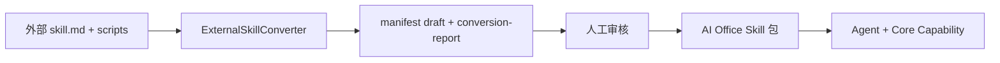
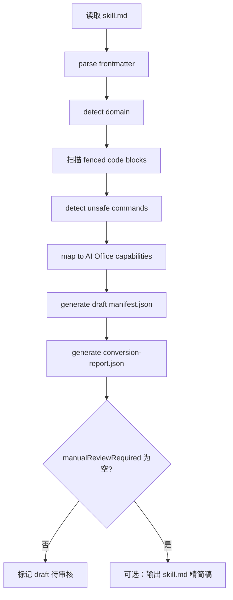

# 外部 Coding-Agent Skill → AI Office Skill 转换规范

> 版本：v0.1（设计稿）  
> 适用范围：`ai_writer3.0-public`  
> 关联：[AI_OFFICE_SKILL_BOUNDARY_DESIGN.md](./AI_OFFICE_SKILL_BOUNDARY_DESIGN.md)、[AI_OFFICE_CORE_CAPABILITY_API.md](./AI_OFFICE_CORE_CAPABILITY_API.md)  
> 参考外部 skill 样例：`docs/pptskill.md`、`docs/wordskill.md`

---

## 1. 为什么外部 coding-agent skill 不能直接进入 AI Office Skill 商店运行

仓库中的 `docs/pptskill.md`、`docs/wordskill.md` 等文档属于 **面向 Cursor / Codex 等 coding agent** 的技能说明：教 agent 在**用户本机**执行 shell、安装 npm/pip/dotnet 依赖、写 PptxGenJS/OpenXML C# 脚本并产出文件。这与 AI Office Skill 的运行模型根本不同。

| 维度 | 外部 coding-agent skill | AI Office Skill |
|------|-------------------------|-----------------|
| **执行主体** | Coding agent + 用户终端 | AI Office 宿主 + Core Capability |
| **运行时协议** | `skill.md` 自然语言 + 任意 CLI | `manifest.json` + Capability Catalog |
| **副作用** | `bash`/`node`/`python`/`dotnet` 任意路径读写 | 仅 `workspace.*`、`document.*`、`deck.*`、`docx.*` 等白名单 |
| **依赖** | `npm install -g`、`pip install`、本地 SDK | 平台内置引擎，Skill **不得**安装依赖 |
| **模型** | Agent 可直连外部 API | 仅 `llm.generate` / `llm.generateJson` |
| **安全** | 信任 agent 自律 | `closed_world`、Validator、`skillCallable` |

**直接进入商店的后果：**

1. **无法审计**：manifest 无法表达「允许执行 `node compile.js`」。  
2. **破坏边界**：Skill 会替代 PPT 渲染器、DOCX 解析器、LLM 网关（见 Skill 边界设计 §2.3）。  
3. **不可移植**：依赖用户是否安装 PowerPoint、.NET SDK、markitdown。  
4. **与 Catalog 冲突**：`pptx.import` 为 `restricted`、`planned` 能力无法从 markdown 命令中推断。  

因此，外部 skill 必须先经 **转换（conversion）** 变为：声明式 `manifest.json` + 可安装 `assets/` + 保留为说明的 `skill.md`，再由 **Agent 编排 Core Capability** 完成等价能力。



---

## 2. 外部 skill 中常见内容

| 内容类型 | 典型位置 | 用途（对外部 agent） | AI Office 处理方式 |
|----------|----------|----------------------|-------------------|
| **skill.md / SKILL.md** | 包根目录 | 主说明 + prompt | 保留为 `skill.md`（非运行时协议） |
| **frontmatter** | YAML 头 | id、版本、描述、license | 映射 → `manifest.json` 基本字段 |
| **triggers** | frontmatter 或正文 | 激活关键词 | → `manifest.triggers[]` |
| **CLI commands** | 正文代码块 | `$CLI …`、`node`、`python -m` | → capability 映射或 `unsupportedRuntimeBehaviors` |
| **scripts/** | 可执行目录 | setup、compile、validate | **不打包为可执行**；规则抽取 → `assets/rules/` |
| **references/** | Markdown 知识库 | 场景指南、API 参考 | 压缩摘录 → `assets/prompts/` 或 `skill.md` 附录 |
| **templates/** | `.pptx` / `.docx` | 物理模板 | → `assets/template.*` |
| **validation rules** | XSD、gate-check、QA 清单 | 交付前校验 | → `deckTemplate.validate` / `documentTemplate.validate` 规则 JSON |

### 2.1 外部 skill 典型技术栈（需显式禁用运行时执行）

| 技术 | 出现位置（本仓库样例） | 禁止作为 Skill 运行时行为 |
|------|------------------------|---------------------------|
| PptxGenJS | `pptskill.md` Step 5–6 | `node compile.js`、`require('pptxgenjs')` |
| markitdown | `python -m markitdown` | 任意 Python 子进程 |
| OpenXML SDK / .NET CLI | `wordskill.md` `$CLI`、`task.csx` | `dotnet run`、任意 C# 脚本执行 |
| Shell setup | `setup.sh` / `setup.ps1` | 依赖安装与环境探测 |

---

## 3. AI Office 转换后的目标类型

| 目标类型 | `manifest.kind` | 产出物 | 说明 |
|----------|-----------------|--------|------|
| **Template Skill** | `template` | `template.pptx` / `template.docx`、`fields.schema.json`、`slot-rules.json` | 静态版式与占位 |
| **Workflow Skill** | `workflow` | `workflow.steps[]` → capability id | 多步流程声明，**不**含可执行脚本 |
| **Style Skill** | `style` | `styleProfile.json`、prompt 片段 | 配色、字体、语气、slide 类型偏好 |
| **Adapter Skill** | `adapter` | 字段映射、格式约定 | 外部命名 → 平台 DTO（少见独立包，多与 Template 并存） |
| **Adapter Rules** | （`assets` 角色） | `writeback-rules.json`、`ooxml-order-rules.json` | 供 `docx.writeback` / Validator 读取，**非**可执行代码 |

一个外部 skill **通常拆成多个** AI Office 包（见 §5、§6），而不是 1:1 单包。

---

## 4. 通用转换规则

### 4.1 frontmatter → manifest 基本字段

| frontmatter | manifest.json |
|-------------|---------------|
| `name` | `id`（加命名空间前缀，如 `ai-office.ppt.workflow.*`） |
| `description` | `description` |
| `license` | `license` |
| `metadata.version` | `version` |
| `metadata.category` | `tags[]` 或 `category` |
| `metadata.author` | `author` |
| `metadata.sources` | `provenance.sources[]` |

### 4.2 triggers → manifest.triggers

```json
"triggers": ["PPT", "PPTX", "presentation", "幻灯片", "汇报"]
```

去重、小写归一化可选；中文 trigger 保留。

### 4.3 CLI commands → capability 或 unsupportedRuntimeBehaviors

| 检测到命令模式 | 转换动作 |
|----------------|----------|
| `python -m markitdown *.pptx` | `requiredCapabilities` += `pptx.extract`；原命令 → `unsupportedRuntimeBehaviors` |
| `node compile.js` / `pptxgenjs` | 映射工作流 → `deck.create`, `deck.applyPatch`, `deck.render`；禁止保留 node 执行 |
| `$CLI create/edit/apply-template` | 映射 → `docx.importTemplate`, `docx.writeback`, `docx.export` |
| `$CLI validate --gate-check` | → `documentTemplate.validate` + 规则入 `assets/` |
| `bash scripts/setup.sh` | **仅** `unsupportedRuntimeBehaviors` |
| `scripts/env_check.sh` | `unsupportedRuntimeBehaviors`（可记 `manualReviewRequired: setup`） |

**unsupportedRuntimeBehaviors** 条目结构（写入 conversion-report，可选写入 manifest `x-ai-office-unsupported`）：

```json
{
  "behavior": "shell.exec",
  "source": "pptskill.md:94",
  "original": "cd slides && node compile.js",
  "reason": "closed_world: no arbitrary node execution",
  "suggestedCapabilityChain": ["deck.create", "deck.applyPatch", "deck.render"]
}
```

### 4.4 执行环境：默认禁止

以下在转换时 **一律** 标记为禁止，不得进入 Skill 包的可执行入口：

- `shell` / `bash` / `powershell` / `cmd`
- `node` / `npm` / `npx`
- `python` / `pip`
- `dotnet run` / `dotnet script` / 任意 `.csx`
- 任意 `install` / `setup` / `env_check`

### 4.5 领域映射表

| 外部工作流片段 | AI Office Capability（见 Core API §3–§4） |
|----------------|----------------------------------------|
| PptxGenJS 从零创建 | `deck.create` → `deck.applyPatch` → `deck.render` |
| markitdown 读 PPTX | `pptx.extract`（**非** `pptx.import` 给普通 Skill） |
| XML 模板编辑 PPTX | `deck.applyPatch` + `deck.render` + `deckTemplate.validate` |
| OpenXML 创建/编辑 DOCX | `document.create` / `document.applyPatch` + `docx.export` |
| 套模板 / writeback | `docx.importTemplate` → `docx.writeback` |
| 字段分析 | `docx.extractFields` |
| XSD / business validate | `documentTemplate.validate` 或 `deckTemplate.validate` |
| 设计系统 / style recipes | **Style Skill** `styleProfile` |
| 物理模板文件 | `assets/template.pptx` / `template.docx` |

### 4.6 templates → assets/

```
skill-package/
├── manifest.json
├── skill.md              # 精简说明 + Agent prompt 摘录
├── assets/
│   ├── template.pptx
│   ├── slot-rules.json
│   ├── styleProfile.json
│   ├── writeback-rules.json
│   └── prompts/
│       └── slide-types-excerpt.md
└── conversion-report.json   # 可选随包附带，商店审核用
```

### 4.7 validation pipeline → Registry

外部「Validation pipeline」「QA Process」「gate-check」不转为 shell 步骤，转为：

- `documentTemplate.validate` / `deckTemplate.validate` 的规则 JSON  
- Workflow Skill 中一步：`capability: deckTemplate.validate`（`planned` 前仅静态声明）

---

## 5. `docs/pptskill.md` 转换方案

### 5.1 建议拆包

| AI Office 包 | kind | 来源章节 |
|--------------|------|----------|
| **PPT Workflow Skill** | `workflow` | Creating from Scratch Step 1–4、7；Reading；Editing 流程 |
| **PPT Style Skill** | `style` | Theme Object、design-system、style recipes、字体与页码徽章规则 |
| **PPT Template Skill** | `template` | 16:9 版式、slide-types 布局、slot-rules（若绑定母版 pptx） |

### 5.2 保留在 `skill.md`（人类 / Agent 辅助）

- Overview、任务路由表（Read / Edit / Create）  
- 5 种 slide page types 语义说明（不含 PptxGenJS API 全文）  
- QA 检查清单（文字版，执行由 `deckTemplate.validate` 承担）  
- 常见 pitfalls 摘要（指向 `assets/prompts/pitfalls-excerpt.md`）

### 5.3 迁入 manifest / rules / prompts

| 原内容 | 目标 |
|--------|------|
| frontmatter `name: pptx-generator` | `id: ai-office.ppt.workflow.pptx-generator` 等 |
| triggers（正文 + metadata） | `manifest.triggers` |
| Theme keys 表 | `assets/styleProfile.json`（Style Skill） |
| `slides/slide-*.js` 模式 | **删除可执行**；转为 `workflow.steps` + `deck.applyPatch` 槽位 schema |
| `compile.js` / `node compile.js` | `unsupportedRuntimeBehaviors` |
| `python -m markitdown` | `pptx.extract` + unsupported 原命令 |
| references/*.md 全文 | `assets/prompts/` 节选；API 参考不进入 runtime |

### 5.4 PPT Template Skill 推荐 `requiredCapabilities`

（与 [AI_OFFICE_SKILL_BOUNDARY_DESIGN.md](./AI_OFFICE_SKILL_BOUNDARY_DESIGN.md) §8.3 一致）

```json
[
  "deck.render",
  "deck.preview",
  "deckTemplate.validate",
  "workspace.copyFile"
]
```

**不得**包含 `pptx.import`、`deck.importPptx`。

### 5.5 PPT Workflow Skill 推荐 `requiredCapabilities`

```json
[
  "llm.generateJson",
  "pptx.extract",
  "deck.create",
  "deck.applyPatch",
  "deck.render",
  "deck.preview",
  "runtime.reportProgress"
]
```

「从零创建」在外部 doc 中靠 PptxGenJS；转换后由 Agent 用 `llm.generateJson` 生成 slide plan → `deck.applyPatch` → `deck.render`。

---

## 6. `docs/wordskill.md` 转换方案

### 6.1 建议拆包

| AI Office 包 | kind | 来源 |
|--------------|------|------|
| **Document Workflow Skill** | `workflow` | Pipeline A/B/C 路由、Sequential 多 pipeline |
| **Document Template Skill** | `template` | Scenario C、模板 assets、字段 schema |
| **DOCX Adapter Rules** | `assets` + 可选 `adapter` kind | Critical rules、openxml_element_order、writeback |

### 6.2 禁止直接运行的 CLI / 环境命令

以下写入 `unsupportedRuntimeBehaviors`，**不得**出现在 Skill 包 `scripts/` 可执行入口：

| 命令 / 模式 | 原因 |
|-------------|------|
| `bash scripts/setup.sh` / `setup.ps1` | 安装依赖 |
| `scripts/env_check.sh` | 环境探测 |
| `dotnet run --project ... MiniMaxAIDocx.Cli` | 任意 CLI |
| `$CLI create/edit/apply-template/validate/merge-runs/fix-order/diff` | 应由 `docx.*` capability 替代 |
| `scripts/doc_to_docx.sh` | shell 转换 |
| `scripts/docx_preview.sh` | 改为 `document.renderPreview`（planned） |
| 任意 `task.csx` / `#r "nuget: DocumentFormat.OpenXml"` | 任意 C# 执行 |

### 6.3 能力映射（wordskill 专用）

| 外部 Pipeline | AI Office |
|---------------|-----------|
| A CREATE | `document.create` → `document.applyPatch` → `docx.export` |
| B FILL-EDIT | `document.load` → `document.applyPatch` → `docx.export` |
| C FORMAT-APPLY | `docx.importTemplate` → `docx.writeback` → `docx.export` |
| Validation pipeline | `documentTemplate.validate` + `assets/xsd-rules.json` |
| gate-check XSD | `documentTemplate.validate`（规则资产化） |

### 6.4 Document Template Skill 推荐 `requiredCapabilities`

```json
[
  "docx.importTemplate",
  "docx.extractFields",
  "docx.writeback",
  "docx.export",
  "documentTemplate.validate"
]
```

### 6.5 保留在 `skill.md` vs 规则资产

| 保留 skill.md | → manifest / assets |
|---------------|---------------------|
| Pipeline 路由决策树（文字） | Workflow `workflow.steps` 分支说明 |
| Critical rules 表格 | `assets/rules/ooxml-element-order.json` |
| Samples/*.cs 索引 | `assets/prompts/samples-index.md`（**不**打包 .cs 可执行） |
| typography / design_principles | Style Skill `styleProfile` + prompt 摘录 |

---

## 7. `conversion-report.json` 格式

转换器对每个源 skill 输出一份报告，供审核与 CI 归档。

```json
{
  "$schema": "https://ai-office.local/schemas/conversion-report-v1.json",
  "reportVersion": "1",
  "generatedAt": "2026-05-16T00:00:00.000Z",
  "converterVersion": "external-skill-converter-0.1.0",

  "sourceSkill": {
    "path": "docs/pptskill.md",
    "name": "pptx-generator",
    "frontmatterHash": "sha256:…"
  },
  "sourceType": "coding-agent-markdown",

  "detectedDomain": "presentation",

  "detectedCommands": [
    {
      "line": 54,
      "language": "bash",
      "command": "python -m markitdown presentation.pptx",
      "classification": "pptx.read"
    },
    {
      "line": 120,
      "language": "bash",
      "command": "cd slides && node compile.js",
      "classification": "pptxgenjs.compile"
    }
  ],

  "unsupportedRuntimeBehaviors": [
    {
      "behavior": "node.exec",
      "source": "docs/pptskill.md:120",
      "original": "cd slides && node compile.js",
      "reason": "closed_world",
      "suggestedCapabilityChain": ["deck.create", "deck.applyPatch", "deck.render"]
    },
    {
      "behavior": "python.exec",
      "source": "docs/pptskill.md:54",
      "original": "python -m markitdown presentation.pptx",
      "reason": "closed_world",
      "suggestedCapabilityChain": ["pptx.extract"]
    }
  ],

  "recommendedConversion": {
    "packages": [
      {
        "draftManifestId": "ai-office.ppt.workflow.pptx-generator",
        "kind": "workflow",
        "confidence": 0.85
      },
      {
        "draftManifestId": "ai-office.ppt.style.pptx-generator-default",
        "kind": "style",
        "confidence": 0.9
      },
      {
        "draftManifestId": "ai-office.ppt.template.pptx-generator-16x9",
        "kind": "template",
        "confidence": 0.6,
        "note": "需人工提供 template.pptx"
      }
    ]
  },

  "requiredCapabilities": {
    "union": [
      "pptx.extract",
      "deck.create",
      "deck.applyPatch",
      "deck.render",
      "deck.preview",
      "deckTemplate.validate",
      "workspace.copyFile",
      "llm.generateJson",
      "runtime.reportProgress"
    ],
    "byPackage": {
      "ai-office.ppt.workflow.pptx-generator": [
        "llm.generateJson",
        "pptx.extract",
        "deck.create",
        "deck.applyPatch",
        "deck.render",
        "runtime.reportProgress"
      ]
    }
  },

  "manualReviewRequired": [
    {
      "code": "MISSING_TEMPLATE_ASSET",
      "message": "外部 skill 未包含 template.pptx，需人工补充 assets/template.pptx"
    },
    {
      "code": "PLANNED_CAPABILITY",
      "message": "deck.applyPatch 为 planned，Workflow 仅可静态声明直至 invoke 落地"
    },
    {
      "code": "RESTRICTED_CAPABILITY",
      "message": "不得将 pptx.import 写入 Skill manifest"
    }
  ],

  "outputs": {
    "manifestDrafts": [
      "out/ai-office.ppt.workflow.pptx-generator/manifest.json",
      "out/ai-office.ppt.style.pptx-generator-default/manifest.json"
    ],
    "skillMdDrafts": [
      "out/ai-office.ppt.workflow.pptx-generator/skill.md"
    ]
  }
}
```

### 7.1 字段说明

| 字段 | 必填 | 说明 |
|------|------|------|
| `sourceSkill` | ✓ | 源路径与 frontmatter 标识 |
| `sourceType` | ✓ | `coding-agent-markdown` \| `aoskin-legacy` \| `unknown` |
| `detectedDomain` | ✓ | `presentation` \| `document` \| `mixed` |
| `detectedCommands` | ✓ | 自代码块解析的命令列表 |
| `unsupportedRuntimeBehaviors` | ✓ | 不可移植运行时行为 |
| `recommendedConversion` | ✓ | 建议拆包与 kind |
| `requiredCapabilities` | ✓ | 并集与各包分解 |
| `manualReviewRequired` | ✓ | 阻塞或警告项 |
| `outputs` | | 生成物路径（MVP 为本地 out/） |

---

## 8. ExternalSkillConverter 第一版流程

**定位**：离线 CLI / 库；**不**安装、**不**执行、**不**调用 `invokeCapability`。



### 8.1 步骤说明

| 步骤 | 输入 | 输出 |
|------|------|------|
| **parse frontmatter** | YAML `---` 块 | `sourceSkill.name`、`triggers`、`metadata` |
| **detect domain** | triggers + 正文关键词 | `presentation` / `document` / `mixed` |
| **detect unsafe commands** | bash/shell/node/python/dotnet 块 | `detectedCommands` + `unsupportedRuntimeBehaviors` |
| **map capabilities** | 命令分类 + domain | `requiredCapabilities` 并集与分包建议 |
| **generate draft manifest** | 映射表 + 模板 | `out/<id>/manifest.json`（`status: draft`） |
| **generate conversion report** | 全流程结果 | `conversion-report.json` |
| **require manual review** | 任意 `MISSING_*`、`PLANNED_*`、低 confidence | `manualReviewRequired[]` 非空则 **禁止** 自动发布 |

### 8.2 建议代码位置（后续实现，本轮不创建）

```
tools/external-skill-converter/
├── src/
│   ├── parseFrontmatter.ts
│   ├── detectDomain.ts
│   ├── detectUnsafeCommands.ts
│   ├── mapCapabilities.ts
│   ├── emitManifestDraft.ts
│   └── emitConversionReport.ts
└── cli.ts
```

与 `skill_platform_next` 的关系：转换产物 **输入** skill-library 审核流水线，**不**替换 skill-engine 执行逻辑。

---

## 9. 安全原则

| 原则 | 说明 |
|------|------|
| **禁止 shell** | 普通 Skill 不得通过 manifest 触发 `bash`/`powershell` |
| **禁止安装依赖** | 不得包含 `npm install`、`pip install`、`setup.sh` 可执行入口 |
| **禁止任意路径** | 仅 `workspace.readFile` / `writeFile` / `copyFile` 在工作区内 |
| **禁止直连外部模型 API** | 仅 `llm.generate` / `llm.generateJson` |
| **执行仅经 Core Capability** | 所有副作用对应 Catalog 中 `invokeEnabled` 且 `skillCallable` 允许的 id |
| **restricted 能力** | `pptx.import`、`runtime.writeLog`（Template）等不得出现在 Skill `requiredCapabilities`（见 Core API §3.2、§7） |

Validator 在安装与 run 时复核 conversion-report 与 manifest 一致性。

---

## 10. 第一阶段 MVP 范围

| 在 MVP 内 | 不在 MVP 内 |
|-----------|-------------|
| 对 `docs/pptskill.md`、`docs/wordskill.md` 跑转换器（设计草案） | 自动安装到 Skill 商店 |
| 输出 `manifest.json` **draft** | 自动 `invokeCapability` |
| 输出 `conversion-report.json` | 打包 `.aoskin` 签名发布 |
| 输出精简 `skill.md` 草稿（可选） | 执行任何检测到的 CLI |
| 文档化映射规则（本文） | 替换现有 `docs/pptskill.md` 原文件 |

### 10.1 MVP 验收

- [ ] 两份 conversion-report 均列出全部 `detectedCommands`  
- [ ] 所有 node/python/dotnet/shell 命令进入 `unsupportedRuntimeBehaviors`  
- [ ] 推荐拆包 ≥2 个 manifest draft（workflow + style [+ template]）  
- [ ] `requiredCapabilities` 不含 `pptx.import`（presentation）  
- [ ] `manualReviewRequired` 含 `PLANNED_CAPABILITY` / `MISSING_TEMPLATE_ASSET` 等预期项  

### 10.2 MVP 输出目录约定

```
tools/external-skill-converter/out/
├── pptskill/
│   ├── conversion-report.json
│   ├── ai-office.ppt.workflow.pptx-generator/
│   │   ├── manifest.json
│   │   └── skill.md
│   └── ai-office.ppt.style.pptx-generator-default/
│       └── manifest.json
└── wordskill/
    ├── conversion-report.json
    └── ...
```

---

## 11. 参考对照速查

| 外部（pptskill） | AI Office |
|------------------|-----------|
| markitdown | `pptx.extract` |
| PptxGenJS compile | `deck.create` + `deck.applyPatch` + `deck.render` |
| design-system.md | Style Skill |
| slide-types.md | Workflow + Template slot-rules |

| 外部（wordskill） | AI Office |
|-------------------|-----------|
| `$CLI apply-template` | `docx.writeback` |
| `$CLI validate --gate-check` | `documentTemplate.validate` |
| Pipeline A/B/C | Document Workflow Skill 分支 |
| Samples/*.cs | Adapter Rules + prompt 索引（非可执行） |

---

*文档维护：架构组 · 设计稿 v0.1 · 2026-05*
