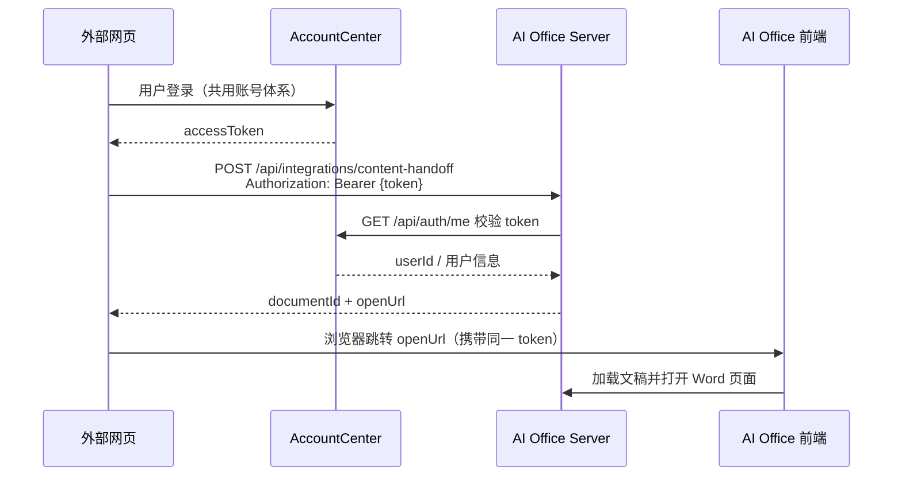

# 外部应用内容投递接口（Content Handoff API）

> 版本：v0.1（已实现）  
> 适用范围：与 AI Office Web 共用 **AccountCenter 账号体系** 的外部网页 / 业务系统  
> 关联实现：`server/src/lib/authUser.ts`、`server/src/features/document/`、`server/src/routes/workspaces.ts`

---

## 1. 概述

外部应用在用户已登录的前提下，将文本内容（后续可扩展图片）投递到 AI Office，并引导用户进入 **Word 文稿工作台（DocumentWorkbench）** 继续编辑。

典型流程：



**当前版本能力边界：**

| 能力 | v0.1 | 说明 |
|------|------|------|
| 账户认证 | ✅ | AccountCenter Bearer Token |
| 目标页面 | ✅ | 固定跳转 Word（`targetPage: "word"`） |
| 文本 / Markdown 内容 | ✅ | 写入 DocumentDraft 并打开编辑器 |
| 图片 | ⏳ 预留字段 | 请求体可传，服务端暂不处理 |
| 其他页面（PPT / 图片等） | ⏳ 预留枚举 | 仅 `word` 生效 |

---

## 2. 环境与 Base URL

| 组件 | 默认地址 | 说明 |
|------|----------|------|
| AI Office Web 前端 | `http://10.20.5.61:5173` | 开发环境 Vite；生产由部署域名决定 |
| AI Office Server | `http://10.20.5.61:3001` | 所有 `/api/*` 请求目标 |
| AccountCenter | `http://127.0.0.1:13100` | 仅服务端校验 token 时使用；**外部应用不直连** |

外部应用应请求 **AI Office Server** 的 `/api/*` 路径（与 AI Office 前端相同），不要直接调用 AccountCenter 的业务写入接口。

生产环境可通过反向代理将前端与 `/api` 置于同一域名，便于共享登录态与 CORS。

---

## 3. 认证

### 3.1 认证方式

与 AI Office Web 完全一致：**无状态 Bearer Token**，由 AccountCenter 签发。

```http
Authorization: Bearer <accountCenterAccessToken>
Content-Type: application/json
```

服务端通过 `requireAccountUser` 将 token 转发至 AccountCenter `GET /api/auth/me` 解析 `userId`，所有文稿数据按该用户隔离。

### 3.2 外部应用如何获得 Token

外部网页在**服务端**调用 `POST /api/integrations/content-handoff` 时必须带：

```http
Authorization: Bearer <accountCenterAccessToken>
```

AI Office 会把该 token 绑定到 handoff 会话。用户点击 `openUrl` 跳转后，前端自动调用 `POST /api/integrations/content-handoff/:handoffId/claim` 完成**免登录进入 Word**，无需在外部网站手动写 localStorage。

| 方式 | 适用场景 | 做法 |
|------|----------|------|
| **A. handoff 认领（推荐）** | 跨域外部系统 | 外部后端 POST 时带 Bearer token → 返回 openUrl → 用户点击跳转 → AI Office 自动 claim 登录并打开 Word |
| **B. 同源共享** | 同一顶级域名 | 也可直接读 `aios_auth_token`，但跨域场景请用 A |
| **C. AccountCenter 登录** | 独立后端 | `POST /api/auth/login` 获取 token 后再 POST handoff |

> 登录接口与 AI Office 前端共用，详见 [登录使用指南](./登录使用指南.md)。

### 3.3 认证探测（可选）

投递前可先调用已有接口确认 token 有效：

```http
GET /api/auth/me
Authorization: Bearer <token>
```

**成功响应示例：**

```json
{
  "id": "user-uuid",
  "username": "zhangsan",
  "displayName": "张三",
  "email": "zhangsan@example.edu.cn"
}
```

**失败响应：**

| HTTP | body | 含义 |
|------|------|------|
| 401 | `{ "message": "未授权" }` | 未携带 token |
| 401 | `{ "message": "token 无效或已过期" }` | token 校验失败 |
| 503 | `{ "code": "ACCOUNT_CENTER_UNREACHABLE", "message": "..." }` | AccountCenter 不可达 |

### 3.4 安全要求

- Token **不得**写入 URL 查询参数或日志；仅通过 `Authorization` 头或跳转前的 `sessionStorage` 短暂传递。
- 生产环境禁用开发 fallback 用户（`web-demo-user`）；无 token 一律 401。
- 建议外部应用与 AI Office 使用 HTTPS。

---

## 4. 核心接口：内容投递

### 4.1 `POST /api/integrations/content-handoff`

将外部文本内容导入当前用户的工作区，创建（或更新）一篇 Word 文稿，并返回前端跳转地址。

> **实现状态：** 已落地。路由：`server/src/features/integrations/routes/contentHandoff.ts`

#### 请求头

```http
POST /api/integrations/content-handoff HTTP/1.1
Host: 10.20.5.61:3001
Authorization: Bearer eyJhbGciOi...
Content-Type: application/json
```

#### 请求体

| 字段 | 类型 | 必填 | 说明 |
|------|------|------|------|
| `targetPage` | `string` | 是 | 目标页面。v0.1 **仅支持** `"word"`（DocumentWorkbench / Word 文稿） |
| `title` | `string` | 否 | 文稿标题。默认 `"外部导入文稿"` |
| `content` | `string` | 是 | 正文内容。支持纯文本或 Markdown（由 `contentFormat` 指定） |
| `contentFormat` | `string` | 否 | `"text"` \| `"markdown"`。默认 `"markdown"` |
| `workspacePath` | `string` | 否 | 工作区路径 token。省略时使用当前用户默认工作区（等价于先调 `GET /api/workspaces/default`） |
| `language` | `string` | 否 | `"zh-CN"` \| `"en-US"`。默认 `"zh-CN"` |
| `documentType` | `string` | 否 | 文稿类型：`report` \| `notice` \| `memo` \| `proposal` \| `summary` \| `official_letter`。默认 `report` |
| `sourceApp` | `string` | 否 | 来源系统标识，如 `"course-portal"`，用于审计 |
| `externalId` | `string` | 否 | 外部系统侧文档 ID，用于幂等与追溯 |
| `metadata` | `object` | 否 | 任意 JSON 元数据，原样存储，不展示给用户 |
| `images` | `array` | 否 | **预留**：图片列表，v0.1 忽略，见 §4.3 |
| `openBehavior` | `string` | 否 | `"redirect"` \| `"same_tab"` \| `"new_tab"`。默认 `"redirect"`，仅影响返回的 `openUrl` 建议用法 |
| `webOrigin` | `string` | 否 | **AI Office 前端公网地址**，用于生成 `openUrl`（如 `http://10.20.5.61:5173`）。优先于服务端 `WEB_ORIGIN` 环境变量 |

**请求示例：**

```json
{
  "targetPage": "word",
  "title": "课程作业：机器学习综述",
  "content": "# 机器学习综述\n\n## 1. 引言\n\n机器学习是人工智能的核心分支……",
  "contentFormat": "markdown",
  "sourceApp": "teaching-platform",
  "externalId": "assignment-2026-042",
  "metadata": {
    "courseId": "CS501",
    "assignmentId": "hw-3"
  },
  "images": []
}
```

#### 成功响应 `200`

```json
{
  "success": true,
  "data": {
    "handoffId": "550e8400-e29b-41d4-a716-446655440000",
    "targetPage": "word",
    "userId": "user-uuid",
    "workspacePath": "web-workspace:user-uuid:ws-default-id",
    "documentId": "doc-7f3c2a1b",
    "artifactId": "art-9d8e7f6a",
    "exportUrl": "/api/artifacts/art-9d8e7f6a/download",
    "filename": "课程作业：机器学习综述.docx",
    "openUrl": "http://10.20.5.61:5173/?handoff=550e8400-e29b-41d4-a716-446655440000",
    "createdAt": "2026-05-24T08:30:00.000Z"
  }
}
```

| 响应字段 | 说明 |
|----------|------|
| `handoffId` | 本次投递会话 ID，供前端拉取详情 |
| `documentId` | AI Office 内部文稿 ID |
| `artifactId` / `exportUrl` | 导出 DOCX 的 artifact 资源 |
| `openUrl` | **推荐**给外部应用用于浏览器跳转的地址，打开 Word 页面并加载该文稿 |
| `workspacePath` | 工作区路径 token，格式 `web-workspace:{userId}:{workspaceId}` |

#### 错误响应

| HTTP | `success` | `error` / `message` | 含义 |
|------|-----------|---------------------|------|
| 400 | `false` | `targetPage 仅支持 word` | 目标页面不支持 |
| 400 | `false` | `content 不能为空` | 缺少正文 |
| 400 | `false` | `workspacePath 无效或不属于当前用户` | 工作区校验失败 |
| 401 | — | `未授权` / `token 无效或已过期` | 认证失败 |
| 409 | `false` | `externalId 已存在` | 同一 `sourceApp` + `externalId` 重复投递（若启用幂等） |
| 500 | `false` | `导入失败：...` | 服务端内部错误 |

---

### 4.2 `POST /api/integrations/content-handoff/:handoffId/claim`

用户从外部网站跳转到 AI Office 时，**前端自动调用**（无需 Authorization）。handoffId 即临时凭证。

```http
POST /api/integrations/content-handoff/550e8400-e29b-41d4-a716-446655440000
Content-Type: application/json
```

**成功响应：**

```json
{
  "success": true,
  "data": {
    "token": "<accountCenterAccessToken>",
    "user": {
      "id": "user-uuid",
      "username": "zhangsan",
      "displayName": "张三",
      "email": "zhangsan@example.edu.cn"
    },
    "handoff": {
      "handoffId": "550e8400-e29b-41d4-a716-446655440000",
      "targetPage": "word",
      "documentId": "doc-7f3c2a1b",
      "workspacePath": "web-workspace:user-uuid:ws-default-id",
      "title": "课程作业：机器学习综述",
      "status": "ready",
      "result": { }
    }
  }
}
```

前端收到后：写入 token → 自动登录 → 进入 Word 页面并展开文稿内容。

---

### 4.3 `GET /api/integrations/content-handoff/:handoffId`

供 AI Office **前端**或调试使用。**无需 Authorization**（handoffId 为临时密钥，24h 有效）。

```http
GET /api/integrations/content-handoff/550e8400-e29b-41d4-a716-446655440000
```

**成功响应：**

```json
{
  "success": true,
  "data": {
    "handoffId": "550e8400-e29b-41d4-a716-446655440000",
    "targetPage": "word",
    "documentId": "doc-7f3c2a1b",
    "workspacePath": "web-workspace:user-uuid:ws-default-id",
    "title": "课程作业：机器学习综述",
    "status": "ready"
  }
}
```

| `status` | 含义 |
|----------|------|
| `ready` | 文稿已写入，可打开编辑器 |
| `expired` | handoff 已过期（默认 TTL 24h） |
| `failed` | 导入失败 |

---

### 4.4 图片字段（预留，v0.1 不处理）

后续版本将在 Markdown 正文中插入图片。客户端可提前按下列 schema 传参，**v0.1 服务端忽略该数组**。

```json
{
  "images": [
    {
      "id": "img-1",
      "filename": "architecture.png",
      "mimeType": "image/png",
      "contentBase64": "<base64-encoded-bytes>",
      "alt": "系统架构图",
      "caption": "图 1 系统总体架构",
      "insertAfter": "section-intro"
    }
  ]
}
```

| 字段 | 类型 | 说明 |
|------|------|------|
| `id` | `string` | 客户端生成的图片引用 ID |
| `filename` | `string` | 文件名 |
| `mimeType` | `string` | `image/png` \| `image/jpeg` \| `image/webp` 等 |
| `contentBase64` | `string` | 图片二进制 Base64（不含 `data:` 前缀） |
| `alt` | `string` | 无障碍替代文本 |
| `caption` | `string` | 图注 |
| `insertAfter` | `string` | 插入位置锚点（章节 ID 或 Markdown 占位符） |

---

## 5. 辅助接口（已有，对接时可复用）

### 5.1 获取默认工作区

若外部应用需要显式指定 `workspacePath`，可先获取用户默认工作区：

```http
GET /api/workspaces/default
Authorization: Bearer <token>
```

```json
{
  "success": true,
  "workspace": {
    "name": "默认工作区",
    "path": "web-workspace:user-uuid:abc123",
    "hasDocument": false,
    "modifiedAt": "2026-05-20T10:00:00.000Z",
    "isDefault": true
  }
}
```

### 5.2 账户登录（独立域名外部系统）

```http
POST /api/auth/login
Content-Type: application/json

{
  "username": "zhangsan",
  "password": "***"
}
```

响应中含 token 字段（与 AI Office 前端存储格式一致），后续请求携带 `Authorization: Bearer ...` 即可。

---

## 6. 前端跳转约定（Word 页面）

v0.1 **固定**跳转 Word 文稿工作台（`DocumentWorkbench`），对应内部 workspace 模式 `freewrite` / `document`。

### 6.1 推荐跳转方式

外部应用在收到 `POST /api/integrations/content-handoff` 响应后，**直接让用户点击 `openUrl`** 即可，无需再写 token：

```javascript
// 外部后端（已有 AccountCenter token）
const res = await fetch('http://ai-office-host:3001/api/integrations/content-handoff', {
  method: 'POST',
  headers: {
    Authorization: `Bearer ${accountCenterToken}`,
    'Content-Type': 'application/json',
  },
  body: JSON.stringify({
    targetPage: 'word',
    title: '作业标题',
    content: '# 正文\n\n...',
    webOrigin: 'http://10.20.5.61:5173',  // 你的 AI Office 前端地址
    sourceApp: 'teaching-portal',
  }),
})
const { openUrl } = (await res.json()).data
// 前端页面直接跳转
window.location.href = openUrl
```

AI Office 打开后会自动 claim 登录并进入 Word 编辑器。

### 6.2 openUrl 格式

```
{WEB_ORIGIN}/?handoff={handoffId}
```

示例：

```
http://10.20.5.61:5173/?handoff=550e8400-e29b-41d4-a716-446655440000
```

AI Office 前端收到 `handoff` 参数后将：

1. 读取 token，进入 **workspace** 场景；
2. 打开 **Word / 文稿** 面板（`DocumentWorkbench`）；
3. 调用 `GET /api/integrations/content-handoff/:handoffId` 加载文稿；
4. 呈现编辑器。

> 前端 handoff 处理：`src/App.tsx`、`src/features/document/components/DocumentWorkbench.tsx`

---

## 7. 完整对接示例

### 7.1 cURL

```bash
TOKEN="<account-center-access-token>"

# 可选：验证 token
curl -s "http://10.20.5.61:3001/api/auth/me" \
  -H "Authorization: Bearer $TOKEN"

# 投递内容并获取跳转地址
curl -s -X POST "http://10.20.5.61:3001/api/integrations/content-handoff" \
  -H "Authorization: Bearer $TOKEN" \
  -H "Content-Type: application/json" \
  -d '{
    "targetPage": "word",
    "title": "外部导入示例",
    "content": "# 标题\n\n正文内容。",
    "contentFormat": "markdown",
    "sourceApp": "demo-portal"
  }'
```

### 7.2 JavaScript（fetch）

```javascript
async function handoffToWord({ token, title, content, externalId }) {
  const res = await fetch('/api/integrations/content-handoff', {
    method: 'POST',
    headers: {
      'Authorization': `Bearer ${token}`,
      'Content-Type': 'application/json',
    },
    body: JSON.stringify({
      targetPage: 'word',
      title,
      content,
      contentFormat: 'markdown',
      sourceApp: 'my-portal',
      externalId,
    }),
  })

  const body = await res.json()
  if (!res.ok || !body.success) {
    throw new Error(body.error || body.message || 'handoff failed')
  }

  // 跳转前写入 token，供 AI Office 前端读取
  sessionStorage.setItem('aios_auth_token', token)
  window.location.href = body.data.openUrl
}
```

### 7.3 纯文本示例

```json
{
  "targetPage": "word",
  "title": "会议纪要",
  "content": "会议时间：2026-05-24\n参会人：张三、李四\n\n一、议题\n……",
  "contentFormat": "text"
}
```

---

## 8. 限流与超时

| 项 | 默认值 | 说明 |
|----|--------|------|
| 全局限流 | 200 次 / 15 分钟 / IP | 与其他 API 共用 |
| 请求超时 | 30 秒 | 普通接口；导入为同步写入，不应触发 AI 长任务 |
| CORS | 允许 `WEB_ORIGIN` 及本地开发端口 | 跨域外部应用需将域名加入 `WEB_ORIGIN` 环境变量 |

---

## 9. 错误码汇总

| 场景 | HTTP | 建议处理 |
|------|------|----------|
| 未登录 | 401 | 引导用户重新登录 AccountCenter |
| token 过期 | 401 | 刷新 token 或重新登录 |
| 参数缺失 | 400 | 检查 `targetPage`、`content` |
| 工作区无权限 | 400 | 使用默认工作区或检查 `workspacePath` |
| AccountCenter 不可用 | 503 | 稍后重试，提示运维 |
| 导入引擎失败 | 500 | 重试；保留 `externalId` 便于排查 |

---

## 10. 与现有能力的关系

| 已有 API | 与本接口区别 |
|----------|--------------|
| `POST /api/documents/start` | AI 生成文稿（异步任务 + 轮询），需 `prompt`，不适合直接导入外部已定稿文本 |
| `POST /api/document/import-docx` | 上传 `.docx` 文件，非 JSON 文本投递 |
| `POST /api/artifacts` | 通用 artifact 存储，无「跳转 Word 页面」语义 |
| `POST /api/work-report/events` | 轻量事件上报，不创建可编辑文稿 |

本接口专为 **外部系统 → Word 编辑器** 的跨应用 handoff 设计。

---

## 11. 版本规划

| 版本 | 内容 |
|------|------|
| v0.1 | 文本 / Markdown 导入 + 固定跳转 Word + AccountCenter 认证 + 图片字段预留 |
| v0.2 | 图片写入 DOCX；`targetPage` 扩展 `ppt` 等 |
| v0.3 | `externalId` 幂等更新；webhook 回调（可选） |

---

## 12. 对接检查清单

- [ ] 外部系统已接入 AccountCenter，能取得有效 Bearer token  
- [ ] 调用 `GET /api/auth/me` 验证 token 在 AI Office Server 上可用  
- [ ] `POST /api/integrations/content-handoff` 使用 `targetPage: "word"`  
- [ ] 跳转前将 token 写入与 AI Office 约定相同的 storage 键  
- [ ] 使用响应中的 `openUrl` 打开 Word 页面  
- [ ] 图片字段可传空数组 `[]`，待 v0.2 启用  

如有域名、CORS 或 SSO 集成问题，请与 AI Office 运维确认 `WEB_ORIGIN` 与反向代理配置。
