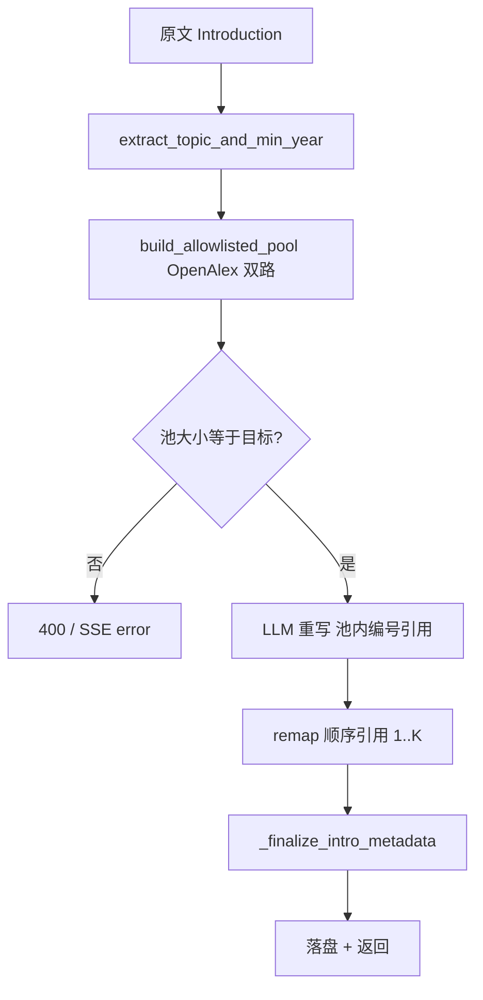

# Introduction 顶刊重写（Intro Remake）交接文档

面向后续维护与排障：说明功能目标、数据流、关键代码位置、配置与常见问题。

---

## 1. 功能概述

- **目标**：在用户提供的 Introduction（或从全文自动抽取的 Introduction）基础上，仅用 **顶刊白名单** 内、且 **带可解析摘要** 的文献池，由 LLM 重写正文；文内引用必须来自该池。
- **输出**：重写后的 Introduction 正文、**按正文首次出现顺序编号** 的参考文献列表（`[1][2]…`）、衔接说明、原文引用审计、文献池元数据等。
- **约束**：引用编号在 **交付前** 会从「池内序号 `pool_index`」映射为「论文体例顺序号」；池内编号仍保留在 `references[].pool_index` 与 `literature_pool[]` 中供对照。

---

## 2. API 与前端入口

| 方式 | 路径 | 说明 |
|------|------|------|
| 同步 JSON | `POST /api/v1/remake/introduction` | 请求体见 `IntroductionRemakeRequest`，响应 `IntroductionRemakeResponse` |
| SSE 流式 | `POST /api/v1/remake/introduction/stream` | `text/event-stream`：`meta` → `delta`（正文片段）→ `done`（完整 payload）或 `error` |

**请求字段**（[`models.py`](../backend/app/models.py) `IntroductionRemakeRequest`）：

- `project_id`（必填）
- `selected_text`：Introduction 原文；可与 `auto_extract_intro` 配合
- `auto_extract_intro`：为 true 时从项目 PDF/全文自动抽取 Introduction（无需选中文本）
- `context`：可选用户补充说明
- `max_papers_for_llm`：文献池目标条数，默认 **100**，范围 1–200

**前端**：[`frontend/src/components/Sidebar/FunctionPanel.tsx`](../frontend/src/components/Sidebar/FunctionPanel.tsx) 中「Introduction 顶刊重写」走 SSE，默认 `max_papers_for_llm: 100`；结果展示 [`ResultDisplay.tsx`](../frontend/src/components/Sidebar/ResultDisplay.tsx) `IntroductionRemakeDisplay`。

---

## 3. 后端处理流水线（逻辑顺序）

实现主文件：[`backend/app/agents/introduction_remaker.py`](../backend/app/agents/introduction_remaker.py)。

1. **正文准备**  
   - 普通模式：`selected_text` 经 `extract_clean_text`。  
   - `auto_extract_intro`：`PaperProcessor` 取全文 → `extract_introduction_from_full_text`（LLM 切 Introduction）。

2. **检索主题压缩** — `extract_topic_and_min_year`  
   - LLM 输出短 `openalex_search`、可选 `persons`、`paper_publication_year`；失败则 `content_checker.extract_topic_from_text` 兜底。  
   - 日志：`[IntroRemake] OpenAlex search query (compressed): ...`

3. **文献池** — `build_allowlisted_pool`（[`intro_literature.py`](../backend/app/services/intro_literature.py)）  
   - 仅 **Introduction** 使用：两路 OpenAlex（**70%** `cited_by_count:desc` + **30%** `publication_date:desc`），`per_page=200`，单路 raw 上限约 350，早停。  
   - 过滤：**顶刊 source_id 白名单** + **摘要非空**（`abstract` 或 `abstract_inverted_index`）。  
   - 不足目标条数时依次尝试：`topic`、`topic + review`（clamp）、更短 query、首词等（见 `intro_literature` 内 `run_topic`）。  
   - **成功条件**：`len(pool) == max_papers_for_llm`（默认 100），否则报错（同步 `ValueError` / 流式 SSE `error`）。

4. **LLM 重写**  
   - **流式**：`_iter_rewrite_intro_plain` → `iter_chat_stream_deltas`（[`llm_stream.py`](../backend/app/services/llm_stream.py)），模型仍输出 **池内编号** `[k]` 或 `[a, b]`。  
   - **同步 / 流式失败回退**：`_rewrite_intro_llm`，整段 JSON（含 `remade_introduction`、`references` 等）。  
   - `max_tokens` 受 **DeepSeek 上限 8192** 约束：[`config.py`](../backend/app/config.py) `DEEPSEEK_MAX_OUTPUT_TOKENS`，`llm_stream` 内会 clamp。

5. **引用校验与顺序重映射**  
   - `_validate_citations`：括号内数字须在 `1..len(pool)`，支持 `[14, 53]` 多引用（正则 `_IN_TEXT_CITE_RE`）。  
   - `remap_introduction_citations_pool_to_sequential`：按首次出现将池编号改为 `[1][2]…`，重复文献同号。  
   - `_validate_sequential_citations`：顺序号须在 `1..K`（K = 去重后引用篇数）。

6. **元数据第二段** — `_finalize_intro_metadata`  
   - 在已顺序化的正文上，向 LLM 要 `continuity_notes`、`original_reference_audit`；**references 列表由代码按 `citation_pool_order` 固定生成**，避免模型打乱顺序。  
   - JSON 解析失败时有兜底结构。

7. **富化参考文献** — `_enrich_references`  
   - 每条含：`reference_number`（1..K）、`pool_index`、`citation`、`title`、`doi` 等。

8. **持久化** — `ProjectManager.save_remake_result(..., remake_type="introduction", ...)`  
   - 目录：`data/projects/<project_id>/remakes/introductions/`（见 [`project_manager.py`](../backend/app/project_manager.py)）。

---

## 4. 顶刊白名单与 OpenAlex

- 配置：[`backend/app/data/tier1_journals.json`](../backend/app/data/tier1_journals.json)（多组期刊 → 若干 OpenAlex `source_id`）。  
- 加载与匹配：[`tier1_journals.py`](../backend/app/services/tier1_journals.py) `work_matches_allowlist`。  
- Introduction **专用** 单页请求：[`openalex_client.py`](../backend/app/services/openalex_client.py) `fetch_works_filtered_page` / `OpenAlexClient.fetch_intro_filtered_page`（**不改变**全局 `per_page=25`，以免影响 content check / idea）。  
- 环境变量：`OPENALEX_EMAIL`（建议配置，OpenAlex polite pool）。  
- 网络失败：`fetch_works_filtered_page` 对 `RequestException` 记 **warning** 并返回 `[]`，避免刷屏 traceback；根因仍是 **本机到 api.openalex.org 不可达** 时需修网络/代理。

---

## 5. 环境变量与相关配置

| 变量 | 用途 |
|------|------|
| `DEEPSEEK_API_KEY` | LLM |
| `DEEPSEEK_BASE_URL` | 默认 `https://api.deepseek.com` |
| `DEEPSEEK_MODEL` | 默认 `deepseek-chat` |
| `DEEPSEEK_MAX_OUTPUT_TOKENS` | 默认 `8192`，与 API 上限一致 |
| `OPENALEX_EMAIL` | OpenAlex `mailto` |
| `PAPER_REMAKE_DATA_DIR` | 数据根目录（可选） |

---

## 6. 响应与前端展示约定

- **`remade_introduction`**：已做 **顺序引用** 映射后的正文（与列表 `[1][2]…` 一致）。  
- **`references`**：与正文顺序一致；`reference_number` 为正文中的编号；`pool_index` 为检索池内序号（界面可灰字标注「池内编号」）。  
- **`literature_pool`**：完整池列表，项上 `pool_index` 为池序号，**不等于** 正文顺序号；前端已在文献池折叠说明中区分。  
- **流式**：`delta` 阶段用户仍可能短暂看到模型输出的 **池内编号**；最终以 `done` 与落盘结果为准。

---

## 7. 常见问题与排障

| 现象 | 可能原因 | 处理方向 |
|------|-----------|----------|
| 顶刊+摘要文献不足 `n/N` | 主题过窄、年份下限过严、白名单过紧、OpenAlex 无结果 | 调 Introduction/ context、放宽 `paper_publication_year` 推断、扩展 `tier1_journals.json` |
| OpenAlex 日志 warning / eligible=0 | 网络不可达、防火墙 | 检查服务器出网、代理；本机 `curl https://api.openalex.org/works?mailto=...` |
| DeepSeek `max_tokens` invalid | 超过 8192 | 已 clamp；勿在单请求里再调大 |
| 引用校验失败 | 括号内数字不在 1..N 或非池内文献 | 看模型输出；可加强 prompt 或后处理 |
| 顺序引用校验失败 | 重映射后仍出现超范围序号 | 检查是否有非标准括号内容被误匹配 |

日志前缀：`[IntroRemake]`、`[IntroPool]`、`[OpenAlex]`、`[Tier1Journals]`。

---

## 8. 关键文件索引

| 路径 | 职责 |
|------|------|
| `backend/app/agents/introduction_remaker.py` | 全流程编排、LLM、引用映射、SSE |
| `backend/app/services/intro_literature.py` | 文献池构建（双路、摘要、早停） |
| `backend/app/services/openalex_client.py` | OpenAlex 通用 + Intro 单页 |
| `backend/app/services/llm_stream.py` | SSE 格式、`iter_chat_stream_deltas` |
| `backend/app/services/tier1_journals.py` | 白名单 |
| `backend/app/data/tier1_journals.json` | 白名单数据 |
| `backend/app/routers/remake.py` | 路由注册 |
| `backend/app/models.py` | 请求/响应模型 |
| `backend/app/project_manager.py` | 结果保存路径 |
| `frontend/.../FunctionPanel.tsx` | 触发 Intro + SSE |
| `frontend/.../ResultDisplay.tsx` | Intro 结果 UI |
| `frontend/src/services/api.ts` | `remakeIntroduction`、SSE 客户端 |

---

## 9. 与 NFTCORE 的对应关系（便于对照）

- 检索前 **压缩 query**、**双路检索（高被引 + 最新）** 思路对齐 NFTCORE `OpenAlexFetcher.fetch_references`；本服务在 **顶刊过滤 + 摘要必选 + 固定池大小** 上更严，且 **不修改** 全局 OpenAlex 客户端的默认分页大小。

---

## 10. 后续可改进方向（非缺陷）

- 流式过程中实时显示顺序编号需前端缓冲整段再替换，实现成本较高。  
- 极窄主题下强制 100 篇可能失败；可按产品改为「最小池大小 + 降级提示」。  
- 可将 `INTRO_MAX_RAW_PER_ARM`、`QUALITY_RATIO` 改为环境变量或配置项。

---

*文档版本：与当前仓库实现一致；修改代码时请同步更新本节与「关键文件索引」。*
