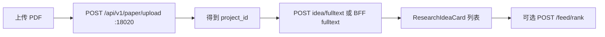

# Research 四项测试指南（PDF Idea / 模板作图 / X Feed 排序 / Science Relay 期刊推荐）

面向 **测试栈端口**（与主站隔离）。完整端口表见 [`server/dev/README.md`](../dev/README.md)。

| 服务 | 端口 | URL |
|------|------|-----|
| FastAPI（Paper Remake） | **18020** | http://127.0.0.1:18020 |
| Express BFF | **13001** | http://127.0.0.1:13001 |
| 测试 UI（推荐） | **25176** | http://127.0.0.1:25176 |
| 简易调试页 | **25175** | http://127.0.0.1:25175 |
| Swagger | **18020** | http://127.0.0.1:18020/docs |

---

## 一、测试前准备

### 1. 环境变量（测试栈 — 仅 `server/dev/`）

```bash
cp ai-office-web/server/dev/research-test.env.example ai-office-web/server/dev/research-test.env
# 填写 LLM_* / QWEN_API_KEY、OPENALEX_EMAIL
```

一键启动时会自动加载；详见 [`server/dev/README.md`](../dev/README.md)。BFF 鉴权仍用 `server/.env.local`（`PORT` / `PAPER_REMAKE_BASE_URL` 由启动脚本覆盖为 13001 / 18020）。

### 2. Python 依赖（18020，conda）

```bash
cd ai-office-web/server
npm run setup:research-conda
conda activate aios-research-backend
```

会创建环境 `aios-research-backend`（Python 3.11）并安装 `backend/requirements.txt`（PDF、matplotlib、pandas 等）。若无 `backend/.env` 会从 `.env.example` 复制一份。

### 3. 登录 Token（仅 BFF 需要）

测试 UI 顶栏 **Bearer Token**：从主站登录后取 `localStorage` 的 `aios_auth_token`，或开发环境 AccountCenter 账号。

- **PDF 上传**：走 FastAPI **不需要** Token  
- **生成 Idea / Feed 排序 / 作图（经 BFF）**：**需要** Token  

### 4. 测试素材

| 测试项 | 准备文件 | 仓库路径 |
|--------|----------|----------|
| PDF → Idea | 一篇科研 PDF（英文/中文均可，建议 2–20 页） | 自备 |
| 模板作图 | 两列数值 CSV（波长-强度） | [`server/dev/test-fixtures/sample_pl_spectrum.csv`](../dev/test-fixtures/sample_pl_spectrum.csv) |
| X 排序 | 无需额外文件；可勾选订阅关键词增加排序信号 | UI 左栏订阅 |
| Science Relay 期刊推荐 | 远端 rsync 或内置小样 | [`dev/test-fixtures/sciencerelay-mini`](../dev/test-fixtures/sciencerelay-mini)；见第六节 |

**Science Relay 数据（`research-test.env`）**

- 开箱：`SCIENCERELAY_DATA_DIR=dev/test-fixtures/sciencerelay-mini`（3 条样例，无需 SSH）
- 生产数据：`bash dev/sync-sciencerelay-data.sh` 或 `SCIENCERELAY_SYNC_ON_START=1` 启动时 rsync  
  远端路径 `.../sciencerelay/data/articles-manifest.json`；BFF 会自动识别 `data/` 子目录

---

## 二、启动服务（一条命令）

先完成上一节 conda 配置，再：

```bash
cd ai-office-web/server
npm run dev:research-test-stack
```

脚本会启动 FastAPI **18020**、BFF **13001**、测试 UI **25176**，并等待健康检查后打印访问地址。按 **Ctrl+C** 停止全部服务；日志在 `server/dev/.logs/`。

分终端启动见 [`server/dev/README.md`](../dev/README.md)。

自检：

```bash
curl -s http://127.0.0.1:18020/health    # {"status":"healthy"}
curl -s http://127.0.0.1:13001/api/research/parity   # fastApiHealthy: true（需 BFF 已起）
```

---

## 三、测试 1：输入 PDF → 输出科研 Idea

### 流程



### 方式 A — 测试 UI（推荐）

1. 打开 http://127.0.0.1:25176 ，顶栏填 **Bearer Token**  
2. 中间栏 **「测试 1：PDF → Idea」** → 选择 PDF → 自动填入 `project_id` 并勾选 **全文多段**  
3. 选择左侧 **研究领域**（影响 `field` 与排序）  
4. 勾选 **「生成后 Feed 排序」**（测试 3）  
5. 点击 **「生成科研 Idea」**  

### 方式 B — curl（不经过 UI）

```bash
# 1) 上传 PDF
curl -s -X POST "http://127.0.0.1:18020/api/v1/paper/upload" \
  -F "file=@/path/to/your/paper.pdf"
# 记下返回的 project_id，例如 20260526_120000_abc123

# 2) 全文 Idea（v2，卡片格式）
curl -s -X POST "http://127.0.0.1:18020/api/v1/remake/idea/fulltext/v2" \
  -H "Content-Type: application/json" \
  -d '{"project_id":"<project_id>","field":"AI for Science"}'

# 或经 BFF（需 Token）
curl -s -X POST "http://127.0.0.1:13001/api/research/ideas/generate/fulltext" \
  -H "Authorization: Bearer <TOKEN>" \
  -H "Content-Type: application/json" \
  -d '{"projectId":"<project_id>","field":"AI for Science"}'
```

### 预期输出

| 项 | 预期 |
|----|------|
| 上传 | `project_id`、`paper_filename`、`status` |
| 生成成功 | `success: true`，`ideas` 为 **3–5 条**（全文模式可能更多后经合并） |
| 每条 Idea | 含 `title`、`coreObservation`、`hypothesis`、`sourcePapers`、`feasibilityScore`、`noveltyScore` |
| 失败常见原因 | 未配 `LLM_API_KEY`；PDF 无法提取文本；`project_id` 无效；BFF 未带 Token |
| 耗时 | 全文多段：**数十秒～数分钟**（视 PDF 长度）；选段模式更快 |

**不是预期：** 返回 AI 生图 URL、返回原始 PDF 批注文件。

---

## 四、测试 2：输入数据 → 模板作图（非 AI 生图）

### 说明

- 使用 **matplotlib + 模板注册表**（`PlotService`）  
- **不会** 调用 `/api/image/jobs`、nanobanana 等生图 API  
- 输出为 **PNG base64** 科学图表（折线、光谱等）

### 方式 A — 测试 UI

1. 右侧 **「模板画图（API）」**  
2. 选择 [`sample_pl_spectrum.csv`](../dev/test-fixtures/sample_pl_spectrum.csv) 或自备 CSV  
3. 可先点 **「仅推荐」** → 看到 `recommended_chart`（如 `line`）、`reasoning`  
4. 点 **「生成图表」** → 页面出现 **折线图 PNG**  

可选：`template_id=pl_line`，关闭 **LLM 数据类型识别** 可加快且免 LLM。

### 方式 B — curl

```bash
# 推荐
curl -s -X POST "http://127.0.0.1:13001/api/research/plots/recommend?contract=v2" \
  -H "Authorization: Bearer <TOKEN>" \
  -H "Content-Type: application/json" \
  -d "$(python3 -c 'import pathlib; print({"rawText": pathlib.Path("ai-office-web/server/dev/test-fixtures/sample_pl_spectrum.csv").read_text(), "useLlmTypeDetection": False})')"

# 出图（multipart）
curl -s -X POST "http://127.0.0.1:13001/api/research/plots/generate?contract=v2" \
  -H "Authorization: Bearer <TOKEN>" \
  -F "file=@ai-office-web/server/dev/test-fixtures/sample_pl_spectrum.csv" \
  -F "use_llm_type_detection=false" \
  -F "auto_recommend=true"
```

直连 FastAPI v2：

```bash
curl -s -X POST "http://127.0.0.1:18020/api/v1/data/plot/v2" \
  -F "file=@ai-office-web/server/dev/test-fixtures/sample_pl_spectrum.csv" \
  -F "use_llm_type_detection=false"
```

### 预期输出

| 字段 | 预期 |
|------|------|
| `success` | `true` |
| `chart_type` | 如 `line` |
| `image` | `data:image/png;base64,...` 或纯 base64 字符串 |
| `recommendation.reasoning` | 简短中文/英文推荐理由 |
| `metadata` / `resolved_template_id` | 如 `pl_line`、`pl_spectrum` |

**不是预期：** 艺术插画、照片级图像、OpenAI Image API 返回的 URL。

---

## 五、测试 3：X 推荐算法相关（Phase A）

当前已落地的是 **规则版 Feed 排序**（借鉴 [x-algorithm](https://github.com/xai-org/x-algorithm) 的 Candidate Pipeline 阶段），**不是** 运行 X 的 Phoenix 模型权重。

### 在测试 UI 中测

1. 顶栏 API 选 **BFF :13001**（排序仅走 BFF）  
2. 勾选 **「生成后 Feed 排序（BFF rule-based-v1）」**  
3. 完成测试 1 或粘贴文本生成 Idea 后，观察：  
   - 文案：`rule-based-v1：N 条候选 → M 条入 Feed`  
   - 每张卡片 **「Feed 分 x.xx」**  
   - 列表顺序按分数从高到低  
4. **第二次** 用相同条件生成：先前展示过的 Idea 会因 `servedIdeaIds` 降权（存在 `localStorage`）

### 单独测排序 API

```bash
curl -s -X POST "http://127.0.0.1:13001/api/research/feed/rank" \
  -H "Authorization: Bearer <TOKEN>" \
  -H "Content-Type: application/json" \
  -d '{
    "field": "AI for Science",
    "ideas": [
      {
        "id": "idea-a",
        "title": "示例 A",
        "field": "未分类",
        "sourcePapers": [],
        "coreObservation": "obs",
        "researchGap": "gap",
        "hypothesis": "hyp",
        "possibleMethod": "method",
        "requiredData": [],
        "requiredExperiment": [],
        "feasibilityScore": 0.6,
        "noveltyScore": 0.9,
        "riskLevel": "medium",
        "nextAction": "read_more"
      }
    ],
    "subscriptionQueries": ["perovskite"]
  }'
```

### 预期输出

| 项 | 预期 |
|----|------|
| `ranking.algorithm` | `rule-based-v1` |
| `ideas[].rankScore` | 0–1 附近小数，可比较排序 |
| `ideas[].rankBreakdown` | `fieldMatch`、`novelty`、`feasibility` 等分项 |
| 领域匹配的 Idea | `fieldMatch` 分项更高，整体更靠前 |

**不是预期：** 与 X For You 时间线完全一致；需要 Phoenix 3GB 权重（见 `third_party/x-algorithm`，未接入生产）。

### 延伸阅读

- 融合路线图：[`X_ALGORITHM_FUSION_EXPLORATION.md`](./X_ALGORITHM_FUSION_EXPLORATION.md)  
- 上游代码：[`third_party/x-algorithm`](../../third_party/x-algorithm)

---

## 六、测试 4：Science Relay 期刊推荐（AI for Science 测试版主页）

> **范围**：仅 [`research-frontend-test`](../dev/research-frontend-test/) 中间栏「Science Relay · 期刊文章推荐（测试版）」；**不是**远端 `sciencerelay` 静态主页。

### 流程

1. 启动测试栈（见第二节），打开 http://127.0.0.1:25176 并填写 BFF Token  
2. 在中间栏选择学科（topic）→ 默认展示**按日期排序的最新列表**  
3. 点击 **应用推荐** → 列表按 X 风格规则分重排，可展开 **X 推荐得分拆解**  
4. 可选：勾选 **生成 LLM 推荐理由**（需 `research-test.env` / `.env.local` 中 LLM Key）

远端有更新时：先 `npm run sync:sciencerelay-data` 或重启栈（`SCIENCERELAY_SYNC_ON_START=1`），再点 **刷新最新**。

### CLI 冒烟（无需 BFF）

```bash
cd ai-office-web/server
npm run smoke:sciencerelay-reco
```

### 关键 API（需 BFF Token）

| 方法 | 路径 | 说明 |
|------|------|------|
| GET | `/api/sciencerelay/topics` | 学科及篇数 |
| GET | `/api/sciencerelay/articles?topic=&limit=&includeDetails=true` | 候选列表 |
| POST | `/api/sciencerelay/reco/rank` | X 风格打分（`dedupeMode` 默认建议 `none`） |
| POST | `/api/sciencerelay/reco/explain` | LLM 理由（失败则 UI 仅显示规则分） |
| POST | `/api/sciencerelay/sync` | 清空 manifest 内存缓存 |

### 预期

| 项 | 预期 |
|----|------|
| 未点「应用推荐」 | 徽章为「未推荐」，按发布时间最新 |
| 应用推荐后 | `rankScore` + 可展开 `topicMatch` / `freshness` 等分项 |
| 去重 | 默认「不去重」；可选 id / DOI |
| 已看过降权 | 滑块 0–0.2，默认约 0.08 |

---

## 七、简易调试页（25175）

适合只验证 API、不跑完整三栏 UI：

```bash
npm run dev:research-lab
# http://127.0.0.1:25175
```

- Tab **Idea**：粘贴文本或配合已上传的 `project_id`  
- Tab **Plot**：上传 CSV、三入口切换  
- Tab **Parity**：检查 BFF 与 18020 健康  

---

## 八、CLI 冒烟

```bash
cd ai-office-web/server
# 主站端口
RESEARCH_SMOKE_SKIP_IDEA=1 npm run smoke:research-idea-plot

# 测试栈端口（需 13001 + 18020 已启动）
npm run smoke:research-idea-plot:test-ports
```

---

## 九、四项测试对照表

| # | 输入 | 访问入口 | 关键 API | 预期产物 |
|---|------|----------|----------|----------|
| 1 | PDF | :25176 中间栏上传 | `POST /api/v1/paper/upload` → `ideas/generate/fulltext` | 多条 `ResearchIdeaCard` |
| 2 | CSV/Excel | :25176 右侧作图 | `POST /api/research/plots/generate` | matplotlib **PNG** + `chart_type` |
| 3 | 已生成 Idea 列表 | :25176 Idea Feed X 排序 | `POST /api/research/feed/rank` | 带 `rankScore` 的排序 Feed |
| 4 | Science Relay JSON | :25176 期刊推荐面板 | `/api/sciencerelay/*` | 最新列表 + 可选推荐分/LLM 理由 |

API 细节：[`RESEARCH_IDEA_PLOT_API.md`](./RESEARCH_IDEA_PLOT_API.md)
