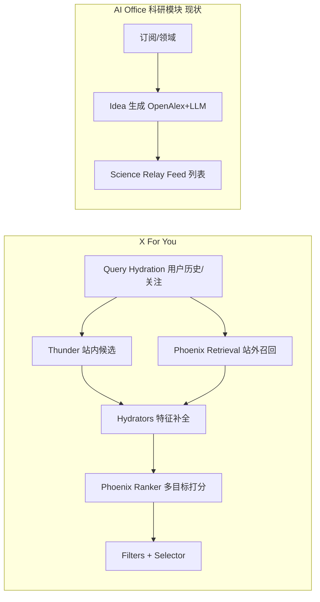
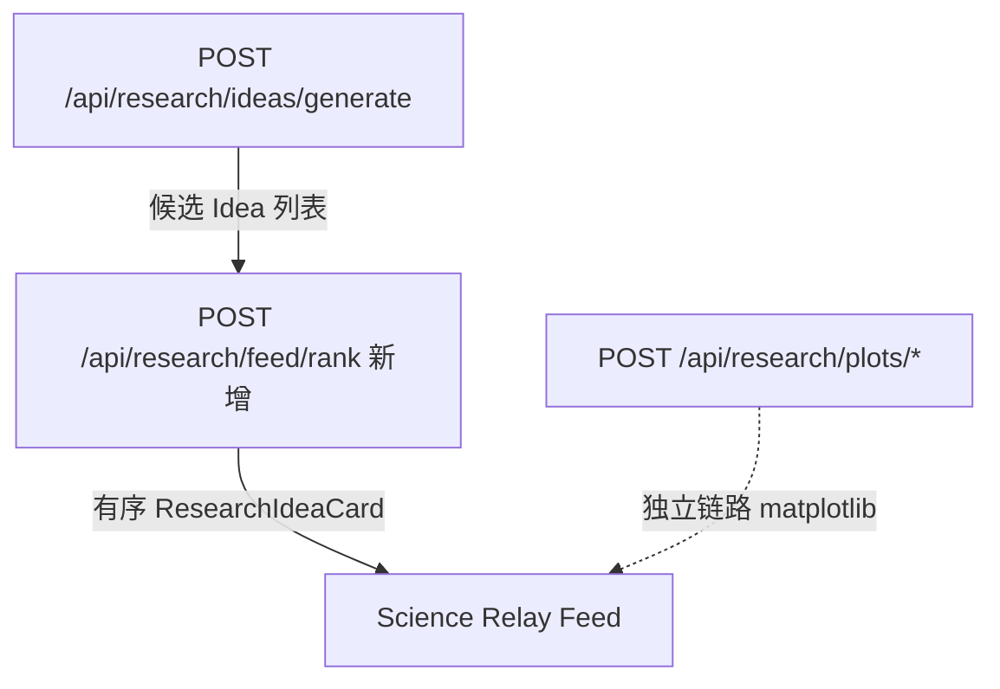

# X 推荐算法（x-algorithm）下载与融合探索

> 仓库已克隆至 monorepo：`third_party/x-algorithm/`（浅克隆，默认 **未** 拉取 ~3GB LFS 模型包）。  
> 对接文档索引：[`RESEARCH_IDEA_PLOT_API.md`](./RESEARCH_IDEA_PLOT_API.md)

---

## 1. 开放的是什么？

| 版本 | 仓库 | 状态 |
|------|------|------|
| **当前（2026）** | [xai-org/x-algorithm](https://github.com/xai-org/x-algorithm) | For You 生产架构：Thunder + Phoenix + Home Mixer |
| 旧版（2023） | [twitter/the-algorithm](https://github.com/twitter/the-algorithm) | Scala 单体，与现网差异大，**不建议**作为融合基线 |

**2026-05-15 更新要点**（见上游 README）：

- 端到端脚本：`phoenix/run_pipeline.py`（检索 → 排序）
- 可运行 mini 模型 + 示例 corpus（Git LFS，`phoenix/artifacts/`）
- **Grox**：内容理解（embedding、安全分类）
- **Home Mixer**：候选编排、过滤、加权、广告插入（Rust）

技术栈：**Rust（服务编排）+ Python/JAX（Phoenix 模型）**，Apache-2.0。

---

## 2. 架构速览（与科研 Feed 的类比）



| X 组件 | 作用 | 在 AI Office 中的对应物（拟） |
|--------|------|-------------------------------|
| **Query hydration** | 用户行为序列、关注列表 | `ResearchWorkspace` 状态、订阅、`localStorage` 行为 |
| **Thunder** | 关注账号的「站内」帖子 | **In-network**：用户库内论文/已保存 Idea、知识库条目 |
| **Phoenix Retrieval** | 全库向量召回 Top-K | **Out-of-network**：OpenAlex / 远程 knowledge 检索 |
| **Phoenix Ranker** | Transformer 预测 like/reply/dwell 等 | 对 `ResearchIdeaCard` 多目标打分（相关性、新颖度、可执行性） |
| **Filters** | 去重、已读、静音、安全 | 已读 Idea、领域过滤、`partialMissing` 降级 |
| **Candidate pipeline** | Source → Hydrate → Score → Select | 可映射为 Express `features/research` 内流水线 |

---

## 3. 本地已下载内容

```
third_party/x-algorithm/
├── phoenix/              # JAX：双塔召回 + Transformer 排序（可本地跑 demo）
│   ├── run_pipeline.py
│   ├── recsys_model.py
│   └── artifacts/        # LFS 占位（需 git lfs pull）
├── home-mixer/           # Rust：For You 编排（需 X 内部依赖，难直接编译）
├── thunder/              # Rust：关注时间线候选（Kafka/PostStore）
├── candidate-pipeline/   # Rust：通用流水线 trait（可借鉴设计）
└── grox/                 # Python：内容 embedding / 安全
```

**能直接跑起来的部分**：主要是 `phoenix/` 下的 **离线推理 demo**（体育帖示例 corpus，不是论文语料）。

**难以直接跑起来的部分**：`home-mixer`、`thunder` 依赖 X 内部 crate（Kafka、特征开关等），适合 **读架构、抄接口形状**，不适合整仓编译进本 monorepo。

---

## 4. 融合策略（分阶段）

原则：**借鉴流水线与两阶段召回/排序思想**，而不是把 X 的帖文模型原样用于论文 Idea（域差距大、训练数据不同）。

### 阶段 A — 设计对齐（1–2 周，无 Grok 权重）✅ 已在测试版落地

- **BFF**：`POST /api/research/feed/rank`（[`feedRanker.ts`](../src/features/research/services/feedRanker.ts)）
- **测试前端**：[`research-frontend-test`](../dev/research-frontend-test/) 生成 Idea 后可选排序，展示 `Feed 分`

在 [`server/src/features/research/`](../src/features/research/) 的 **推荐流水线接口**（对齐 `candidate-pipeline` 阶段）：

| 阶段 | 接口 | 实现（先用现有能力） |
|------|------|----------------------|
| QueryHydrator | 组装 `userId、field、subscriptions、recentIdeaIds` | 读 workspace / AccountCenter |
| Sources | `InNetworkSource` + `OutOfNetworkSource` | 知识库 + OpenAlex |
| Hydrator | 补全 `ResearchIdeaCard` 元数据 | 现有 mapper + LLM 补全 |
| Scorer | 多信号加权 | 规则：`feasibilityScore`、`noveltyScore`、领域匹配 |
| Filter | 去重、已展示 | Bloom / served_history 简化版 |
| Selector | Top-K | 排序后截断 |

**交付**：`POST /api/research/feed/rank` 对已有 Idea 列表重排（输入 candidates，输出有序 feed），测试版 [`research-frontend-test`](../dev/research-frontend-test/) 的 Science Relay 改为「生成 → 排序 → 展示」。

### 阶段 B — Phoenix 思想、自研轻量模型（2–4 周）

| X 能力 | 科研域实现 |
|--------|------------|
| Two-tower 召回 | 论文/Idea 文本 embedding（现有 LLM embedding 或 bge）+ 用户兴趣向量（订阅+点击序列） |
| ANN Top-K | pgvector / 远程 knowledge 向量检索 |
| Ranker 多目标 | 小 Transformer 或 **LLM `invokeLlmJson` 批量打分**（reply→「转为课题」、like→「收藏」） |
| Candidate isolation | 每条 Idea 独立打分 prompt，避免 batch 互相干扰（对应 Phoenix masking 思想） |

**不依赖** x-algorithm 的 3GB 体育 checkpoint；仅参考 `phoenix/recsys_model.py` 的 **动作头设计**（多 engagement logit）。

### 阶段 C — 可选：调用上游 demo 作对照实验

```bash
cd third_party/x-algorithm/phoenix
git lfs pull
uv sync
python run_pipeline.py --artifacts_dir ./artifacts ...
```

用于团队理解「召回→排序」数值行为，**不作为生产路径**。

### 阶段 D — 内容理解（Grox 思路）

论文摘要/图表 → embedding + 安全/质量过滤，可接到：

- Idea 生成后的 **质量门控**
- Plot 推荐前的 **数据类型**（已有 `DataTypeClassifier`，可并列一条 Grox 式多任务头）

---

## 5. 与现有 Idea / 画图 能力的关系



- **Idea 生成**：继续 OpenAlex + `unified_llm`（生成候选）。
- **X 融合点**：生成之后的 **Feed 排序 / 个性化**，不是替换生成器。
- **模板画图**：与 X 推荐正交；最多共享「用户领域 embedding」作上下文。

---

## 6. 法律与运维

- **许可证**：Apache-2.0，可阅读、修改、商用需保留 NOTICE；**不要**与 AGPL 的 `twitter/the-algorithm` 混编在同一衍生作品而不处理许可证冲突。
- **数据**：不得假设能使用 X 用户行为日志；科研 feed 只能用 **本系统** 的点击/转化事件训练。
- **模型权重**：上游 checkpoint 为 **X 帖文域**；论文/Idea 需 **自训或 LLM 打分**，勿直接上线 sports_corpus 权重。

---

## 7. 建议的下一步（落地顺序）

1. 在 `features/research` 定义 `ResearchFeedCandidate` + `rankFeed(candidates, userContext)`（规则版 Scorer）。
2. 测试版 Science Relay：生成 Idea 后调用 `/feed/rank` 再渲染。
3. 为用户行为埋点（select idea、convert to matter、plot 成功）写入 `served_history`，实现 Filter。
4. 评估是否引入向量库做 Phoenix Retrieval 等价物（与 remote knowledge 统一）。
5. 仅当 A/B 需要时，再评估自研 JAX 排序器（参考 `phoenix/recsys_model.py`）。

---

## 8. 参考文件（本地路径）

| 路径 | 用途 |
|------|------|
| `third_party/x-algorithm/phoenix/run_pipeline.py` | 端到端召回+排序入口 |
| `third_party/x-algorithm/phoenix/recsys_model.py` | 排序模型结构 |
| `third_party/x-algorithm/candidate-pipeline/candidate_pipeline.rs` | 流水线阶段枚举 |
| `third_party/x-algorithm/home-mixer/scorers/weighted_scorer.rs` | 多目标加权 |
| `server/src/features/research/routes.ts` | 现有 BFF 扩展点 |
| `src/modules/research/ResearchWorkspace.tsx` | 主前端 Feed（接入方改这里，我们不动） |
